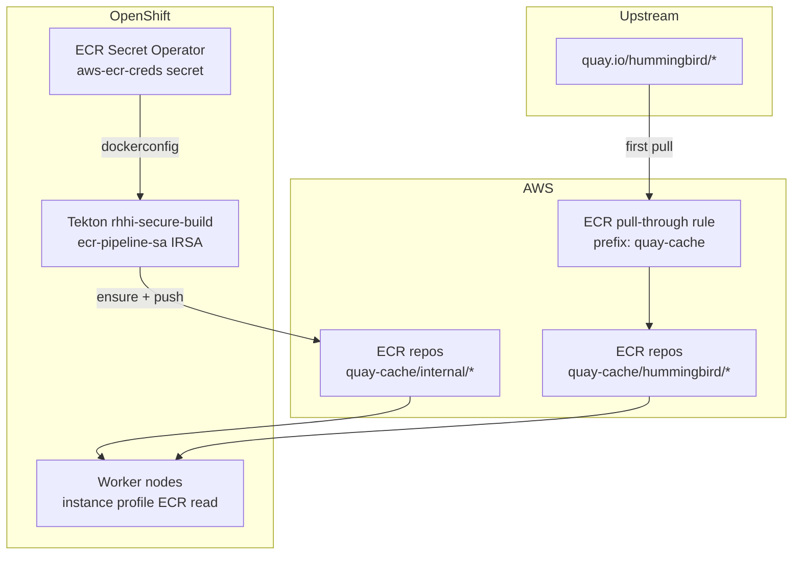
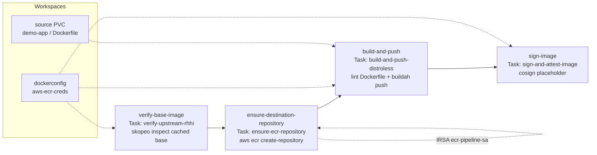

# RHHI Secure Container Supply Chain

Self-contained example implementing the [RHHI blueprint](../../reference/rhhi-blueprint.md): ECR pull-through cache for Red Hat Hardened Images, worker node ECR pull IAM, Tekton verify/build/sign pipeline, and ECR Secret Operator for token refresh.

Designed for eventual extraction to a dedicated repository. AWS resources live in [`terraform/`](terraform/) (wired from root `terraform/10-main.tf`). OpenShift resources are Helm templates under [`helm/rhhi-supply-chain/`](helm/rhhi-supply-chain/).

## Architecture

| Layer | Mechanism | Purpose |
|-------|-----------|---------|
| Worker nodes | `AmazonEC2ContainerRegistryReadOnly` on worker role | Runtime image pulls from ECR pull-through cache |
| Tekton pipeline | IRSA on `ecr-pipeline-sa` | Create destination ECR repo on demand, Buildah push |
| Pipeline namespace | [ECR Secret Operator](https://github.com/rh-mobb/ecr-secret-operator) | Auto-refresh `aws-ecr-creds` dockerconfig (12h ECR tokens) |

### Supply chain flow

Images are referenced by **full ECR pull-through URLs** (`{account}.dkr.ecr.{region}.amazonaws.com/quay-cache/...`), not `quay.io/...`. OpenShift image mirroring is not required for this design.



### Tekton pipeline (`rhhi-secure-build`)

Pipeline definition: [`helm/rhhi-supply-chain/templates/tekton-pipeline.yaml`](helm/rhhi-supply-chain/templates/tekton-pipeline.yaml)



| Task | Auth | Purpose |
|------|------|---------|
| `verify-base-image` | `aws-ecr-creds` | Confirm base image exists in ECR pull-through cache |
| `ensure-destination-repository` | IRSA (`ecr-pipeline-sa`) | Create app repo on demand (`ecr:CreateRepository`) |
| `build-and-push` | `aws-ecr-creds` | Multi-stage buildah build; push to `destination-image` |
| `sign-image` | `aws-ecr-creds` | Cosign sign step (MVP placeholder) |

## Prerequisites

- RHCS credentials (`RHCS_TOKEN` or `RHCS_CLIENT_ID` / `RHCS_CLIENT_SECRET`)
- AWS credentials for Terraform and ECR CLI
- CLI tools: `terraform`, `aws`, `oc`, `helm`, `jq` (`tkn` and `docker`/`podman` for demo)

Pull-through cache targets public `quay.io/hummingbird/*` images — no Red Hat registry credentials are required. If you later point upstream at `registry.redhat.io` or a private quay namespace, add an `ecr-pullthroughcache/` Secrets Manager secret and `credential_arn` on the pull-through rule (see blueprint §2.1).

## Quick Start

### 1. Deploy cluster + AWS RHHI resources

```bash
# From repository root
make cluster.rhhi.init
make cluster.rhhi.plan
make cluster.rhhi.apply
make cluster.rhhi.login
```

`clusters/rhhi/terraform.tfvars` is based on the public cluster example with:

- `enable_gitops_bootstrap = false` (bash + Helm for Day-2)
- `enable_rhhi_supply_chain = true`

### 2. Post-apply Day-2 setup

```bash
make -C clusters/rhhi preflight
make -C clusters/rhhi post-aws-config
make -C clusters/rhhi install
make -C clusters/rhhi seed-cache   # optional debug: verify pull-through before pipeline
```

### 3. Run demo pipeline

```bash
make -C clusters/rhhi run-demo
make -C clusters/rhhi test
make -C clusters/rhhi status
```

Or run everything after cluster apply:

```bash
make -C clusters/rhhi all
make -C clusters/rhhi run-demo
```

## Directory Layout

```
clusters/rhhi/
├── terraform.tfvars          # Cluster + enable_rhhi_supply_chain
├── terraform/                # Portable AWS module (ECR, IAM)
├── helm/rhhi-supply-chain/   # OpenShift operators, Tekton, ECR Secret CR
├── demo-app/                 # Sample distroless Python microservice
├── scripts/                  # Bash automation (Helm install, demo)
└── Makefile                  # Day-2 targets
```

## Helm Values

Terraform outputs are rendered to `helm/rhhi-supply-chain/values.generated.yaml` (gitignored) by `scripts/render-values.sh`. Key values:

| Value | Source |
|-------|--------|
| `global.ecrRegistryUrl` | Terraform `rhhi_supply_chain.ecr_registry_url` |
| `tekton.tektonEcrRoleArn` | Terraform Tekton IRSA role |
| `ecrOperator.roleArn` | Terraform ECR Secret Operator IRSA role |

Override defaults in `config.env` (copy from `config.env.example`).

## GitOps Migration (Follow-up)

The Helm chart and `values.generated.yaml` pattern maps directly to an Argo CD `Application`. Enable `enable_gitops_bootstrap` in tfvars when ready to hand off Day-2 to GitOps.

## Repo Extraction Notes

To move to a standalone repo:

1. Copy `clusters/rhhi/` entirely
2. Include root Terraform wiring snippet from `terraform/10-main.tf` (`module "rhhi_supply_chain"`)
3. Include variables from `terraform/01-variables.tf` and output `rhhi_supply_chain` from `terraform/90-outputs.tf`

## Troubleshooting

**Worker pods cannot pull ECR images:** Confirm worker role has `AmazonEC2ContainerRegistryReadOnly`:

```bash
aws iam list-attached-role-policies --role-name rhhi-HCP-ROSA-Worker-Role
```

**Tekton build auth failures:** Confirm `aws-ecr-creds` exists and ECR Secret Operator CSV is `Succeeded`:

```bash
oc get secret aws-ecr-creds -n user-workload-pipeline
oc get csv -n ecr-secret-operator
```

**Shell-less container debugging:** Use ephemeral debug containers (blueprint §7):

```bash
oc debug pod/<pod> --image=<ecr-registry>/quay-cache/ubi9/ubi-minimal:latest -c debugger
```
