# ROSA HCP Enablement Guide

Implementation guide for deploying Red Hat OpenShift Service on AWS (ROSA) with Hosted Control Planes (HCP) using the three-repository pattern in this project.

**Audience:** Platform engineers, SREs, architects, and delivery teams adopting this pattern in your own or a client's AWS account.

**Assumptions:**

- All three repositories are rehomed into your organization's Git
- Helm charts are forked and published to an organization-owned chart repository (not the public `rh-mobb` GitHub Pages default)

This pattern favors per-cluster state isolation and composable modules over pre-baked environment stacks.

---

## 1. Executive Summary and Architecture

### Three-repository model

| Repository | Role | Upstream source |
|------------|------|-----------------|
| **1. Infrastructure** (this repo) | Terraform: VPC, IAM, ROSA HCP cluster, GitOps bootstrap orchestration | `vp-terraform-rosa` |
| **2. cluster-config** | GitOps configuration consumed by ArgoCD after bootstrap | [rh-mobb/rosa-cluster-config](https://github.com/rh-mobb/rosa-cluster-config) |
| **3. Helm charts** | Bootstrap and app-of-apps charts | [rh-mobb/validated-pattern-helm-charts](https://github.com/rh-mobb/validated-pattern-helm-charts) |

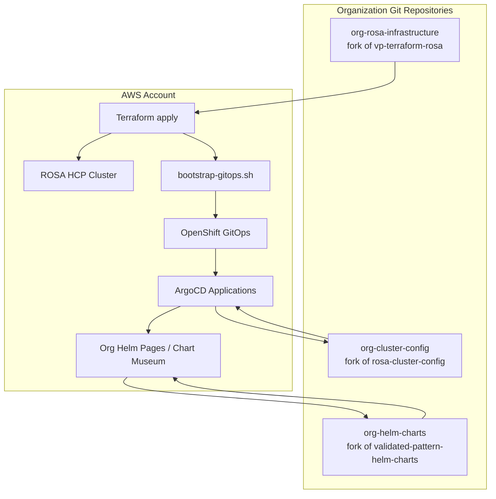

### Deployment phases

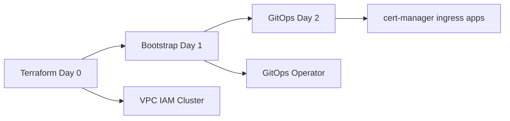

| Phase | What happens | Who drives it |
|-------|--------------|---------------|
| **Day 0** | VPC, IAM, KMS, cluster, EFS, logging IAM, bootstrap values | Terraform (`make cluster.<name>.apply`) |
| **Day 1** | OpenShift GitOps operator, ArgoCD repo wiring | `make cluster.<name>.bootstrap` |
| **Day 2+** | cert-manager, external-dns, ingress, apps, monitoring | ArgoCD sync from cluster-config |

### Terraform vs GitOps boundary

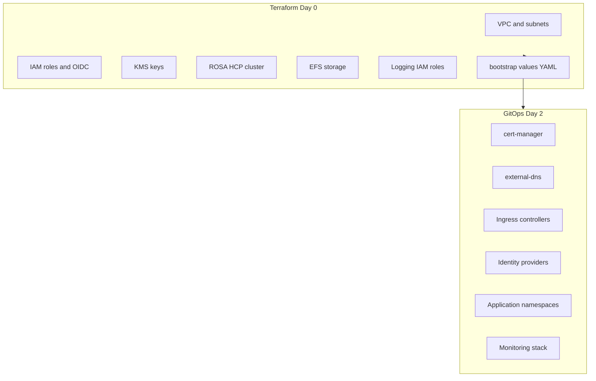

Terraform creates AWS infrastructure and generates Helm values for bootstrap. GitOps deploys Kubernetes resources and ongoing cluster configuration. See [PLAN.md](../../PLAN.md) for the full architecture rationale.

---

## 2. Prerequisites and Access Model

### Tooling and accounts

| Prerequisite | Notes |
|--------------|-------|
| Terraform >= 1.5.0 | See [terraform/00-providers.tf](../../terraform/00-providers.tf) |
| AWS CLI | Configured with permissions for VPC, IAM, ROSA, Secrets Manager |
| `oc`, `helm`, `jq` | Required for bootstrap; see [README-bootstrap-gitops.md](../../scripts/cluster/README-bootstrap-gitops.md) |
| OCM service account (recommended) | For Terraform and CI/CD — see [OCM service accounts](#ocm-service-accounts-recommended) below |
| Personal RHCS token (dev only) | Offline token for local testing — [README.md](../../README.md#rhcs-api-authentication) |
| ROSA subscription / OCM access | [ROSA HCP documentation](https://docs.redhat.com/en/documentation/red_hat_openshift_service_on_aws/) |
| Client VPN (private/egress-zero) | [clusters/README.md](../../clusters/README.md#vpn-tunnel-requirement) |

### OCM service accounts (recommended)

**Use a Red Hat Hybrid Cloud Console service account** for `terraform apply` and CI/CD pipelines — not a personal user offline token. Clusters created with a user token are tied to that individual as the OCM cluster owner. If that person leaves the organization or loses access, cluster ownership, notification routing, and console management can break.

A dedicated service account decouples cluster lifecycle from any single person. Humans manage the cluster through Hybrid Cloud Console RBAC and notification contacts configured **after** creation.

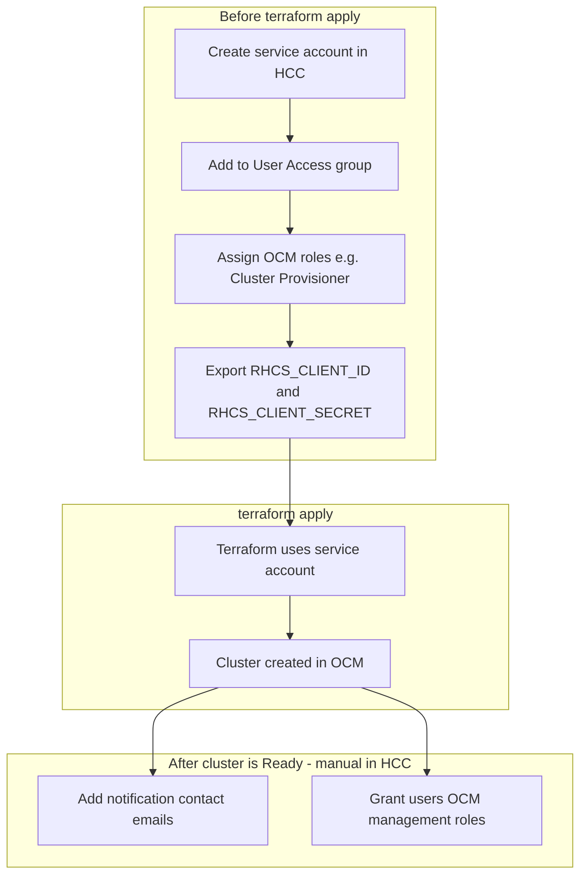

#### Create the service account

1. Sign in to [Red Hat Hybrid Cloud Console](https://console.redhat.com)
2. Go to **User Management → Service accounts** (or **Identity and Access Management → Service accounts**)
3. Create a service account (e.g. `rosa-terraform-provisioner`) and copy the **client ID** and **client secret** — the secret is shown only once
4. Go to **User Access → Groups**
5. Add the service account to a group with OCM roles sufficient to create and manage clusters — typically **OpenShift Cluster Manager** roles such as **Cluster Provisioner** (create/manage) or a custom combination for your policy
6. An Organization Administrator or User Access administrator must perform the group assignment — see [Creating and managing service accounts](https://docs.redhat.com/en/documentation/red_hat_hybrid_cloud_console/1-latest/html/creating_and_managing_service_accounts/) and the [User Access RBAC guide](https://docs.redhat.com/en/documentation/red_hat_hybrid_cloud_console/1-latest/html/user_access_configuration_guide_for_role-based_access_control_rbac/)

**Export credentials for Terraform:**

```bash
export RHCS_CLIENT_ID="your-client-id-uuid"
export RHCS_CLIENT_SECRET="your-client-secret"
# Do not set RHCS_TOKEN when using a service account
```

Store these in `.rhcs_creds` (gitignored) or your CI/CD secret store. See [README.md](../../README.md#rhcs-api-authentication).

**Personal offline tokens** (`RHCS_TOKEN`) are acceptable for short local experiments only. Do not use them for production clusters or shared automation.

#### Post-creation: notification contacts and console access

After `terraform apply` completes and the cluster reaches **Ready**, configure OCM settings in the Hybrid Cloud Console. The service account that created the cluster does not receive human-readable notification emails — you must add contacts explicitly.

**1. Add notification contacts (service logs)**

Cluster notifications (service logs) are how Red Hat SRE communicates about cluster health, upgrades, and required actions. By default, only the cluster **owner** receives email — and when a service account owns the cluster, no mailbox receives them unless you add contacts.

1. Open [OpenShift Cluster Manager](https://console.redhat.com/openshift)
2. Select your cluster
3. Open the **Support** tab (or cluster notifications settings)
4. Click **Add notification contact** and enter one or more team distribution lists or on-call mailboxes (e.g. `platform-oncall@example.com`, `rosa-alerts@example.com`)

See [Cluster notifications](https://docs.redhat.com/en/documentation/red_hat_openshift_service_on_aws_classic_architecture/4/html/cluster_administration/rosa-cluster-notifications) for details on service log types and severity.

**2. Grant users Hybrid Cloud Console management access**

User Access in the Hybrid Cloud Console controls who can view and manage clusters in OCM — this is separate from OpenShift cluster RBAC (`cluster-admin`, etc.) inside the cluster.

1. Go to **User Access → Groups**
2. Create or update a group for your platform team
3. Add **users** (not the provisioning service account) to the group
4. Assign OCM roles appropriate to each role:
   - **Cluster Editor** or **Cluster Provisioner** — manage cluster settings, upgrades, and lifecycle in OCM
   - **Cluster Viewer** — read-only access to cluster details in OCM
5. Users in these groups can open the cluster in the Hybrid Cloud Console, view service logs, and perform permitted OCM actions

Cluster **in-cluster** access (logging into OpenShift itself) is configured separately via identity providers and GitOps — not through User Access.

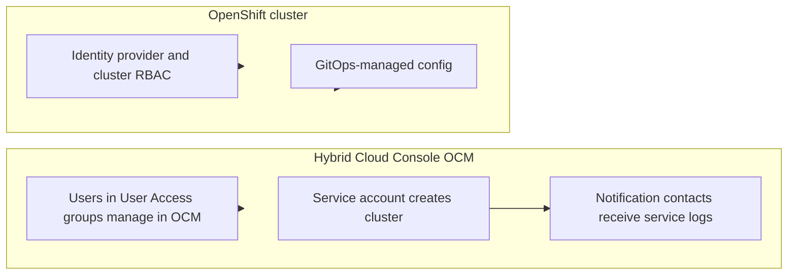

### Authentication and access flow

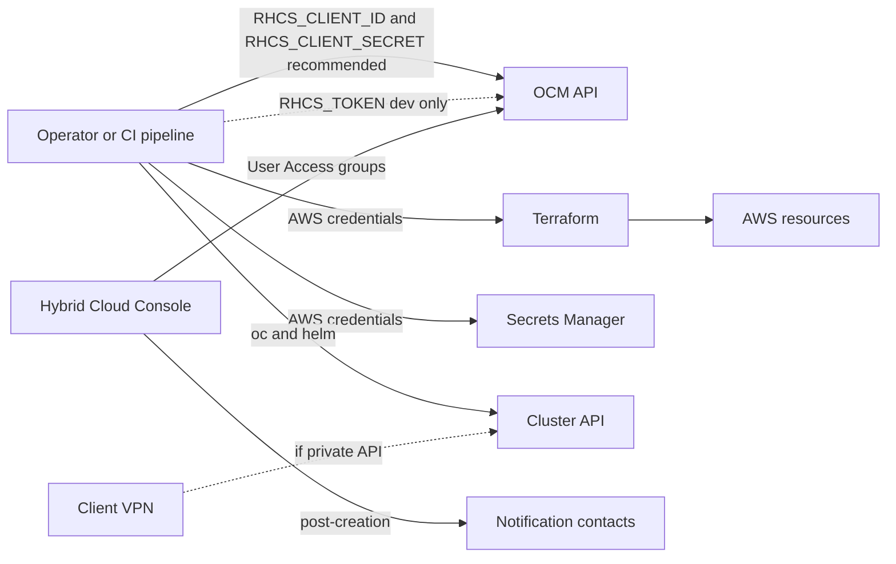

### Credential hygiene

- Never commit secrets to Git
- **Production and CI/CD:** use service account `RHCS_CLIENT_ID` + `RHCS_CLIENT_SECRET` — not personal `RHCS_TOKEN`
- Store credentials in `.rhcs_creds` (gitignored) or CI secrets; rotate service account secrets per your security policy
- **Break-glass cluster admin** (optional, `enable_cluster_admin`): long-lived HTPasswd `admin` in AWS Secrets Manager for `make cluster.<name>.login`. Variable default is `false`; example tfvars set `true`. Optional override: `TF_VAR_admin_password_override`
- **GitOps bootstrap login**: short-lived HTPasswd `bootstrap` user created/destroyed by `make cluster.<name>.bootstrap` — not stored in Secrets Manager and not used for day-2 login. See [Authentication](../getting-started/authentication.md)

---

## 3. Repository Rehoming

Rehome all three repositories before your first `terraform apply`. The workflow below assumes you fork upstream sources into your organization's Git hosting.

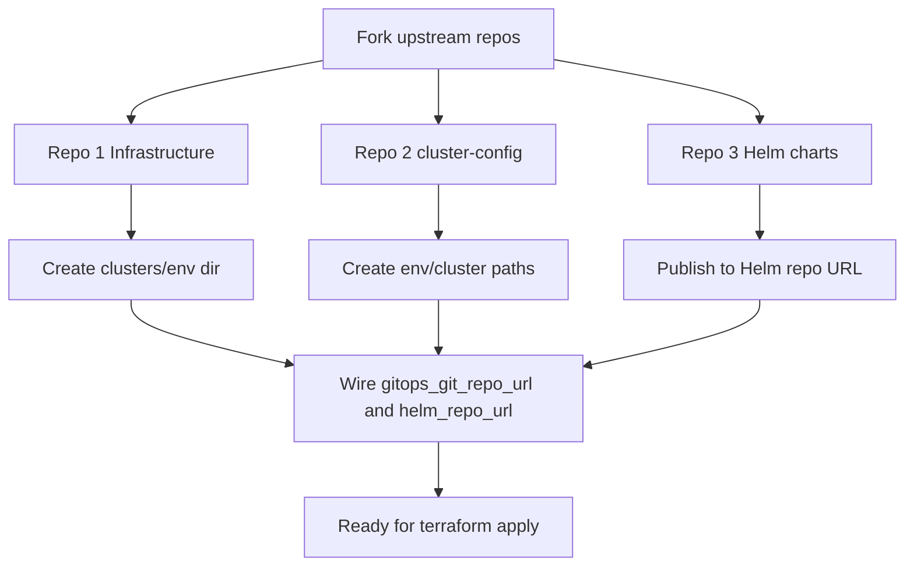

### 3a. Repository 1: Infrastructure (this repo)

1. Fork or copy this repository into your organization (GitHub Enterprise, GitLab, Bitbucket, etc.)
2. Replace example cluster directories under [clusters/](../../clusters/) with your naming convention, e.g. `clusters/<org>-<env>/`
3. Configure remote state (S3 + DynamoDB) — see [clusters/README.md](../../clusters/README.md#backend-configuration) and [CI/CD guide](../guides/ci-cd.md)
4. Pin provider versions in [terraform/00-providers.tf](../../terraform/00-providers.tf)
5. Modules are already in-repo under [modules/infrastructure/](../../modules/infrastructure/) — no external module registry required

**Create a cluster directory:**

```bash
mkdir -p clusters/acme-prod
# Start from the closest reference, then merge blocks from other examples as needed
cp clusters/egress-zero/terraform.tfvars clusters/acme-prod/
# Add BYO VPC IDs from byo-vpc, enable_autonode from autonode, etc.
# Edit clusters/acme-prod/terraform.tfvars
```

See [Composable cluster configuration](#composable-cluster-configuration) for combining multiple reference tfvars.

### 3b. Repository 2: cluster-config

1. Fork [rh-mobb/rosa-cluster-config](https://github.com/rh-mobb/rosa-cluster-config) into your organization
2. Create the directory layout expected by ArgoCD (derived from [hub-values.yaml.tftpl](../../modules/infrastructure/cluster/templates/hub-values.yaml.tftpl)):

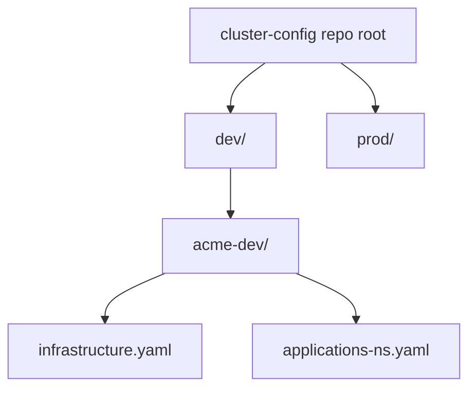

The `gitops_git_path` in Terraform must match the path prefix:

```hcl
enable_gitops_bootstrap = true
gitops_git_repo_url     = "https://github.com/<org>/acme-cluster-config.git"
gitops_git_path         = "dev/acme-dev"
```

ArgoCD resolves `gitPathFile` relative to that path:

- `dev/acme-dev/infrastructure.yaml` — infrastructure app-of-apps (cert-manager, external-dns, etc.)
- `dev/acme-dev/applications-ns.yaml` — application namespace onboarding

**Organization-specific edits** in cluster-config (not Terraform):

- AD/LDAP groups for RBAC
- Ingress hostnames and TLS
- cert-manager issuer configuration
- ClusterLogForwarder and monitoring — see [improvements/ingress.md](../guides/improvements/ingress.md) for ingress examples

### 3c. Repository 3: Helm charts (always fork)

1. Fork [rh-mobb/validated-pattern-helm-charts](https://github.com/rh-mobb/validated-pattern-helm-charts)
2. Publish to your organization-owned Helm repository
3. Point Terraform/bootstrap at your published URL

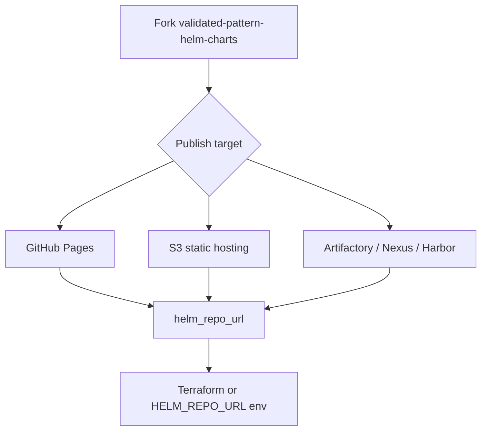

**Chart catalog:**

| Chart | Role |
|-------|------|
| `cluster-bootstrap` | Day 1: GitOps operator + ArgoCD repository wiring |
| `cluster-bootstrap-acm-spoke` | ACM spoke cluster bootstrap |
| `cluster-bootstrap-acm-hub-registration` | Hub-side spoke import |
| `app-of-apps-infrastructure` | Day 2: cert-manager, external-dns, platform infra |
| `app-of-apps-application` | Application namespace onboarding (standalone) |
| `app-of-apps-acm-team-onboarding` | ACM hub fleet onboarding |

**Helm chart dependency chain:**

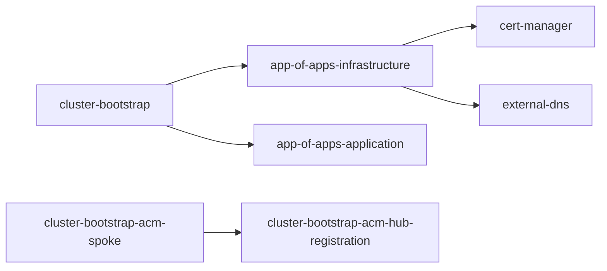

**Version pinning:** Bootstrap chart versions are Terraform variables in the cluster module ([`01-variables.tf`](../../modules/infrastructure/cluster/01-variables.tf)); hub bootstrap values render them via [hub-values.yaml.tftpl](../../modules/infrastructure/cluster/templates/hub-values.yaml.tftpl).

| Chart | Variable | Default |
|-------|----------|---------|
| `app-of-apps-infrastructure` | `app_of_apps_infrastructure_chart_version` | `0.3.0` |
| `app-of-apps-application` | `app_of_apps_application_chart_version` | `1.5.8` |
| `app-of-apps-acm-team-onboarding` | `app_of_apps_acm_team_onboarding_chart_version` | `0.4.1` |
| `cluster-bootstrap` | `helm_chart_version` | `0.5.19` |
| `cluster-bootstrap-acm-spoke` | `helm_chart_acm_spoke_version` | `0.6.14` |
| `cluster-bootstrap-acm-hub-registration` | `helm_chart_acm_hub_registration_version` | `0.2.2` |
| `aws-privateca-issuer` | `helm_chart_awspca_version` | `1.6.1` |

Bump module defaults in [`01-variables.tf`](../../modules/infrastructure/cluster/01-variables.tf) when validated-pattern-helm-charts releases new versions (or override when calling the cluster module). Local `bootstrap-private` may still patch pins from `reference/validated-pattern-helm-charts` when the clone is ahead of Terraform defaults.

**Override Helm repo URL** (not exposed at root `terraform.tfvars` today):

- Edit `helm_repo_url` default in [modules/infrastructure/cluster/01-variables.tf](../../modules/infrastructure/cluster/01-variables.tf), **or**
- Set `HELM_REPO_URL` at bootstrap time — see [README-bootstrap-gitops.md](../../scripts/cluster/README-bootstrap-gitops.md)

### 3d. Local multi-repo development (in-cluster Gitea)

For day-to-day feature work across **cluster-config** and **helm-charts**, use local `reference/` clones and push to **in-cluster Gitea** so Argo CD reconciles the same way a private customer would (GitLab + Artifactory analogue — no GitHub Pages or S3):

```bash
make cluster.<profile>.bootstrap-private
# edit reference/rosa-cluster-config and reference/validated-pattern-helm-charts
make dev.private.sync DEV_CLUSTER_NAME=<profile>
```

Gitea hosts **cluster-config Git** and a **Helm package registry** on a PVC. Chart sync uploads all `charts/*` from your local helm-charts clone (re-upload replaces the same version for fast iteration).

Full guide: [Local Multi-Repo Development](../guides/local-multi-repo-dev.md).

**Optional escape hatch** (single-chart speed, no Gitea/Argo): `make cluster.<profile>.bootstrap-skip-gitops` then `make dev.public.apply-local` — see the guide; not a substitute for merge validation.

**Production validation:** Push PRs in each repo and run canonical Argo sync before merging.

### GitOps CMP tools container image

**Default secrets path:** AWS Secrets Manager integration uses the Red Hat External Secrets Operator (ESO), not AVP. Standard flow is:

1. Terraform creates IAM role access for Secrets Manager ([`enable_secrets_manager_iam = true`](../../terraform/01-variables.tf))
2. Bootstrap publishes ConfigMap `rosa-platform-metadata` (includes `secretsManagerRoleArn`) — see [Platform metadata / IRSA](../architecture/platform-metadata-irsa.md)
3. GitOps installs ESO with `platformMetadata.enabled: true` (no hardcoded account ARN in cluster-config); a chart Job binds IRSA from the ConfigMap
4. `ClusterSecretStore` + `ExternalSecret` sync remote values into Kubernetes `Secret` objects

Do **not** hardcode `arn:aws:iam::ACCOUNT:role/...` for ESO in portable cluster-config — multi-account fleets break, and ESO cannot read its own role from SM before IRSA exists (chicken-and-egg). Full reasoning: [platform-metadata-irsa.md](../architecture/platform-metadata-irsa.md).

See the [`external-secrets-operator` chart](https://github.com/rh-mobb/validated-pattern-helm-charts/tree/main/charts/external-secrets-operator) in your cluster-config infrastructure applications and the Terraform toggle [`enable_secrets_manager_iam`](../../terraform/01-variables.tf).

The `gitops_tools_image` setting is now **optional CMP tooling** for clusters that still run Argo CD Applications with `plugin: true` during migration. It is not required for ESO-based Secrets Manager sync.

**Upstream image** (multi-arch, built from [hack/docker/gitops-tools/](../../hack/docker/gitops-tools/)):

```text
ghcr.io/rh-mobb/validated-pattern-terraform-rosa/gitops-tools:<tag>
```

CI publishes `:latest` and `:sha` tags on merge to main. Pin a digest or SHA tag in production rather than floating `:latest` when CMP plugin mode is enabled.

**When to re-host:** Mirror this image into **your private registry** when any of the following apply:

- `zero_egress = true` (no pull path to `ghcr.io` without a VPC endpoint and allowlist)
- Corporate registry policy (only ECR, Artifactory, Harbor, etc.)
- ACM spoke clusters that must not depend on public GHCR at runtime

Typical target: **Amazon ECR** in the cluster account (or a shared platform registry). Ensure worker nodes and the GitOps repo-server can pull the mirrored image (same-account ECR, pull secrets, or IRSA as appropriate).

**Re-hosting workflow:**

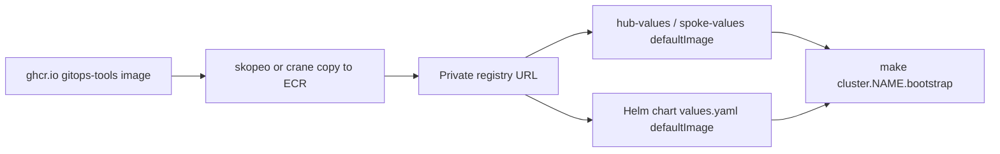

1. Copy the image to your registry (multi-arch recommended):

   ```bash
   # Example: mirror to ECR (run from a host with registry access)
   aws ecr create-repository --repository-name rosa/gitops-tools
   skopeo copy --all \
     docker://ghcr.io/rh-mobb/validated-pattern-terraform-rosa/gitops-tools:latest \
     docker://808082629126.dkr.ecr.us-east-1.amazonaws.com/rosa/gitops-tools:latest
   ```

2. Point Terraform bootstrap values at the mirrored image — set `gitops_tools_image` in the cluster module ([01-variables.tf](../../modules/infrastructure/cluster/01-variables.tf)), which flows into `defaultImage` in both bootstrap templates:

   - [hub-values.yaml.tftpl](../../modules/infrastructure/cluster/templates/hub-values.yaml.tftpl) — hub and standalone (`cluster-bootstrap`)
   - [spoke-values.yaml.tftpl](../../modules/infrastructure/cluster/templates/spoke-values.yaml.tftpl) — ACM spoke (`cluster-bootstrap-acm-spoke`)

   Example module override:

   ```hcl
   gitops_tools_image = "808082629126.dkr.ecr.us-east-1.amazonaws.com/rosa/gitops-tools:9e983e6"
   ```

   Or edit the `defaultImage: ${gitops_tools_image}` line default in those `.tftpl` files in your infrastructure fork.

3. Update **`defaultImage`** in your Helm chart fork as well ([cluster-bootstrap/values.yaml](https://github.com/rh-mobb/validated-pattern-helm-charts/blob/main/charts/cluster-bootstrap/values.yaml) and [cluster-bootstrap-acm-spoke/values.yaml](https://github.com/rh-mobb/validated-pattern-helm-charts/blob/main/charts/cluster-bootstrap-acm-spoke/values.yaml)) so chart defaults match when bootstrap is run outside Terraform or when values are not regenerated.

4. Re-run bootstrap (or apply the rendered ArgoCD CR) and hard-refresh plugin-based Applications if the repo-server image changed after initial install.

For zero-egress Git source mirroring (separate from this container image), see [egress-zero GitOps guide](../guides/egress-zero-gitops.md).

---

## 4. Provider and Reference Material Strategy

### Provider versions

| Provider | Version constraint | Source |
|----------|-------------------|--------|
| `terraform-redhat/rhcs` | `~> 1.7.7` | [terraform/00-providers.tf](../../terraform/00-providers.tf) |
| `hashicorp/aws` | `~> 6.0` | [terraform/00-providers.tf](../../terraform/00-providers.tf) |

### Air-gapped provider mirror

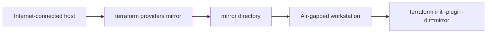

```bash
# On internet-connected host
terraform providers mirror ./provider-mirror

# Copy provider-mirror/ to air-gapped environment
cd terraform/
terraform init -plugin-dir=../provider-mirror
```

## 5. End-to-End Deployment Runbook

### Standard deployment sequence

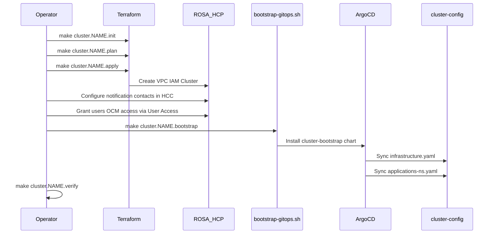

### Bootstrap internals

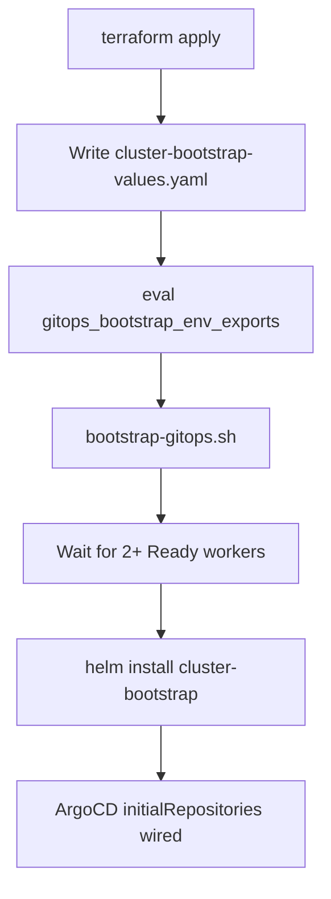

The Makefile ([Makefile.cluster](../../Makefile.cluster)) orchestrates bootstrap:

1. Writes `clusters/<name>/cluster-bootstrap-values.yaml` from `gitops_bootstrap_hub_values` or `gitops_bootstrap_spoke_values`
2. Runs `eval $(terraform output -raw gitops_bootstrap_env_exports)`
3. Executes `gitops_bootstrap_script_path`

### Example walkthrough: Acme organization

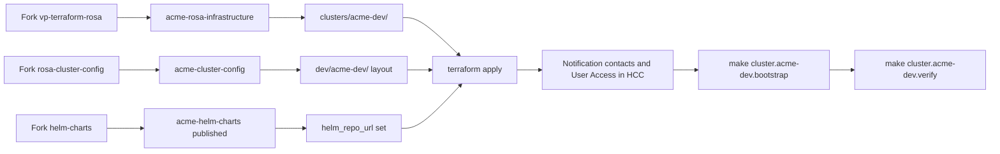

**Commands for a first public dev cluster:**

```bash
# OCM service account credentials (recommended)
export RHCS_CLIENT_ID="your-client-id-uuid"
export RHCS_CLIENT_SECRET="your-client-secret"
# Optional break-glass password override (otherwise Terraform generates one when enable_cluster_admin=true):
# export TF_VAR_admin_password_override="your-secure-password"

# In clusters/acme-dev/terraform.tfvars (example recipes already set this):
#   enable_cluster_admin = true

# Infrastructure
make cluster.acme-dev.init
make cluster.acme-dev.plan
make cluster.acme-dev.apply

# Post-creation (Hybrid Cloud Console — before or after bootstrap)
# 1. Add notification contact emails on cluster Support tab
# 2. Add platform team users to User Access group with OCM roles

# GitOps bootstrap (uses short-lived bootstrap HTPasswd; tears it down afterward)
make cluster.acme-dev.bootstrap

# Day-2 oc login (break-glass admin from Secrets Manager)
make cluster.acme-dev.login

# Validation
make cluster.acme-dev.verify
```

### Post-creation OCM configuration

Complete these steps in the [Hybrid Cloud Console](https://console.redhat.com/openshift) once the cluster is **Ready**. They are not managed by Terraform in this repository.

| Step | Where | Why |
|------|-------|-----|
| Add notification contacts | Cluster → **Support** tab → **Add notification contact** | Service logs and SRE communications need a real mailbox; service account owners do not receive email |
| Grant OCM management access | **User Access → Groups** → add users + OCM roles | Platform engineers manage upgrades and lifecycle in OCM without sharing the provisioning service account |
| Verify cluster visibility | OpenShift Cluster Manager cluster list | Confirm intended users can see and open the cluster |

Do not share the provisioning service account credentials with human operators for day-to-day console use — grant User Access roles instead.

### Composable cluster configuration

Example directories under [clusters/](../../clusters/) are **reference `terraform.tfvars` recipes** — not mutually exclusive topology types. A production cluster often combines characteristics from several examples. You create one directory (e.g. `clusters/acme-prod/`) and compose the variables you need.

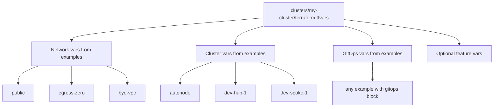

**Configuration dimensions** — pick values independently; merge into a single tfvars file:

| Dimension | Key variables | Reference tfvars |
|-----------|---------------|------------------|
| Network source | `network_type`, `existing_vpc_id`, `existing_private_subnet_ids`, `existing_public_subnet_ids` | [public](../../clusters/public/terraform.tfvars), [egress-zero](../../clusters/egress-zero/terraform.tfvars), [byo-vpc](../../clusters/byo-vpc/terraform.tfvars) |
| Egress posture | `zero_egress`, `private` | [egress-zero](../../clusters/egress-zero/terraform.tfvars) — can combine with BYO VPC |
| Cluster access | `enable_client_vpn`, `enable_bastion` | [egress-zero](../../clusters/egress-zero/terraform.tfvars) |
| Compute model | `enable_autonode`, `default_*_replicas`, `additional_machine_pools` | [autonode](../../clusters/autonode/terraform.tfvars), [public](../../clusters/public/terraform.tfvars) |
| Fleet / ACM | `acm_mode`, hub/spoke bootstrap targets | [dev-hub-1](../../clusters/dev-hub-1/terraform.tfvars), [dev-spoke-1](../../clusters/dev-spoke-1/terraform.tfvars) |
| BGP / Route Server | `enable_route_server`, `route_server_asn`, metal `additional_machine_pools` | [bgp](../../clusters/bgp/terraform.tfvars) — see [CUDN BGP / VPC Route Server](#cudn-bgp--vpc-route-server) |
| GitOps | `enable_gitops_bootstrap`, `gitops_git_repo_url`, `gitops_git_path` | Any example with GitOps enabled |
| Day-0 / break-glass login | `enable_cluster_admin` (default `false`; examples set `true`) | All example tfvars; see [Authentication](../getting-started/authentication.md) |
| Production hardening | `openshift_version`, KMS, `fips`, `enable_termination_protection` | [egress-zero](../../clusters/egress-zero/terraform.tfvars) |

#### Worked example: BYO VPC + egress-zero + AutoNode

A cluster might use a network team's existing VPC, require zero egress, and use Karpenter-based AutoNode. Copy the relevant blocks from each reference file into one `terraform.tfvars`:

```hcl
# --- From byo-vpc: network source ---
network_type = "existing"
existing_vpc_id             = "vpc-xxxxxxxx"
existing_private_subnet_ids = ["subnet-a", "subnet-b", "subnet-c"]
existing_public_subnet_ids  = []  # empty for private API / zero egress

# --- From egress-zero: egress and access ---
zero_egress       = true
private           = true
enable_client_vpn = true
# Ensure BYO VPC has VPC endpoints and no NAT on private routes (see byo-vpc comments)

# --- From autonode: compute model ---
enable_autonode = true
openshift_version = "4.19.30"  # AutoNode version/region constraints — verify current docs
region            = "us-east-1"

# --- Your org: GitOps, naming, day-0 login ---
cluster_name          = "acme-prod-01"
gitops_git_repo_url   = "https://github.com/<org>/acme-cluster-config.git"
gitops_git_path       = "prod/acme-prod-01"
enable_gitops_bootstrap = true
enable_cluster_admin   = true  # break-glass for make login until customer IdP exists
```

**Operational steps** for this combination:

| Concern | Action |
|---------|--------|
| BYO VPC prerequisites | Pre-provision VPC, subnets, endpoints per [byo-vpc/terraform.tfvars](../../clusters/byo-vpc/terraform.tfvars) header comments |
| Zero egress GitOps | CodeCommit mirroring — [egress-zero GitOps guide](../guides/egress-zero-gitops.md) |
| Private API access | `make cluster.<name>.vpn-start` before bootstrap/login |
| AutoNode | Confirm region/version eligibility; optional `autonode_kubernetes_cluster_tag_id` after first apply |
| Bootstrap | Standard `make cluster.<name>.bootstrap` unless ACM spoke (then `bootstrap-spoke`) |

#### Reference tfvars quick index

Use these as copy-paste sources — not as exclusive cluster "types":

| Reference directory | Primary variables to borrow |
|--------------------|----------------------------|
| [public](../../clusters/public/terraform.tfvars) | `network_type = "public"`, dev-sized pools, GitOps block |
| [egress-zero](../../clusters/egress-zero/terraform.tfvars) | `zero_egress`, `private`, Client VPN, production encryption |
| [byo-vpc](../../clusters/byo-vpc/terraform.tfvars) | `network_type = "existing"`, `existing_*` subnet IDs, prerequisite comments |
| [autonode](../../clusters/autonode/terraform.tfvars) | `enable_autonode`, `additional_cluster_properties`, version/region |
| [dev-hub-1](../../clusters/dev-hub-1/terraform.tfvars) | Hub cluster sizing; set `acm_mode = hub` in module |
| [dev-spoke-1](../../clusters/dev-spoke-1/terraform.tfvars) | Spoke GitOps path; use `bootstrap-spoke` Makefile target |
| [bgp](../../clusters/bgp/terraform.tfvars) | `enable_route_server`, multi-AZ metal BGP routers, GitOps path `dev/bgp` |

### CUDN BGP / VPC Route Server

Use the [bgp](../../clusters/bgp/terraform.tfvars) recipe to provision AWS VPC Route Server + IRSA for the [CUDN BGP routing operator](https://github.com/jingczhang/rosa-bgp-operator), with OpenShift Virtualization and operator install driven by [rosa-cluster-config `dev/bgp`](https://github.com/rh-mobb/rosa-cluster-config/tree/main/dev/bgp).

**What Terraform creates** when `enable_route_server = true`:

| Resource | Purpose |
|----------|---------|
| VPC Route Server + ASN | Amazon-side BGP peer (`route_server_asn`, default `64512`) |
| Endpoints (2 per private subnet) | BGP neighbor ENIs; operator discovers via `DescribeRouteServerEndpoints` |
| Route propagation | Private + public route tables |
| IAM role/policy (IRSA) | Trusts `openshift-cudn-bgp-routing:openshift-cudn-bgp-routing-controller-manager` |

**Recipe characteristics** (`clusters/bgp`):

- Public multi-AZ ROSA HCP, OCP **4.21+** (example pins `4.22.2` / `fast-4.22`) for FRR-K8s / CUDN / RouteAdvertisements
- One **Intel bare-metal** worker pool per AZ (`c5.metal`) labeled `bgp_router=true` (OpenShift Virtualization — nested virt is not supported for this path)
- GitOps path `dev/bgp` installs `rosa-virtualization` + `cudn-bgp-routing-operator`
- Set `enable_cluster_admin = true` for `make cluster.bgp.login`

**Cost warning:** Three `c5.metal` nodes in `ap-southeast-2` are ~$16/hr on-demand. Tear down promptly after validation (`make cluster.bgp.destroy_force`).

#### Deploy

```bash
# Requires AWS + RHCS/OCM credentials (service account preferred for apply)
make cluster.bgp.init
make cluster.bgp.plan
make cluster.bgp.apply      # 30–45+ minutes; Route Server finishes early, ROSA cluster dominates
make cluster.bgp.bootstrap  # GitOps + short-lived bootstrap HTPasswd
make cluster.bgp.login      # break-glass admin from Secrets Manager
```

#### Wire BGP config via External Secrets (preferred — issue #51)

Terraform publishes `{cluster_name}-bgp-config` to AWS Secrets Manager (`role_arn`, `region`, `route_server_id`, `route_server_ids`) when `enable_route_server = true`. With `enable_secrets_manager_iam = true`, the ESO IRSA role can read that secret.

Architecture (do not hardcode ESO/operator ARNs in git):

1. Bootstrap writes `rosa-platform-metadata` (`secretsManagerRoleArn`, `bgpConfigSecretName`, …) — [platform-metadata-irsa.md](../architecture/platform-metadata-irsa.md)
2. GitOps installs ESO with `platformMetadata.enabled: true` (binds IRSA from ConfigMap)
3. `cudn-bgp-routing-operator` uses `externalSecret` for operator role / region / routeServerIDs from `{cluster}-bgp-config`

Keep `defaults.plugin: false` in [rosa-cluster-config](https://github.com/rh-mobb/rosa-cluster-config) `dev/bgp/infrastructure.yaml`. Set ESO `target.enabled: false` unless you need the Kuadrant credentials ExternalSecret.

```bash
# Optional verification after apply / bootstrap
cd terraform
export TF_DATA_DIR="../clusters/bgp/.terraform"
terraform init -reconfigure -input=false \
  -backend-config="path=$(pwd)/../clusters/bgp/infrastructure.tfstate" >/dev/null
terraform output -raw bgp_config_secret_name
terraform output -raw secrets_manager_role_arn
oc -n openshift-gitops get configmap rosa-platform-metadata -o yaml
```

Manual fallback (no ESO): annotate the operator ServiceAccount with `bgp_operator_role_arn` and set `cudnBgpConfig.aws` from `route_server_id` / region, then restart the manager pod.

#### Post-deploy validation checklist

1. Workers Ready including three metal BGP routers (`oc get nodes -l bgp_router=true`)
2. OpenShift Virtualization / CNV operator healthy
3. Operator pod Running in `openshift-cudn-bgp-routing` with IRSA (no AWS credential errors in logs)
4. `CUDNBgpConfig` status shows discovered Route Server endpoints / ASN
5. Route Server peers exist for BGP router node IPs (`aws ec2 describe-route-server-peers`)

#### Teardown

```bash
make cluster.bgp.destroy_force
```

Unregister ACM spokes first if this cluster was imported to a hub. Confirm Route Server and metal instances are gone in the AWS console before walking away (cost).

Module reference: [modules/infrastructure/route-server/README.md](../../modules/infrastructure/route-server/README.md).

### Post-bootstrap validation

```bash
make cluster.<name>.verify
# or
python3 scripts/verify_cluster.py --cluster-dir <name>
```

Checks OpenShift GitOps operator health and `cluster-config-applicationset` deployment.

---

## 6. ACM Hub/Spoke Fleet Pattern

For multi-cluster management with Advanced Cluster Management (ACM), deploy a hub cluster first, then register spokes.

### Architecture

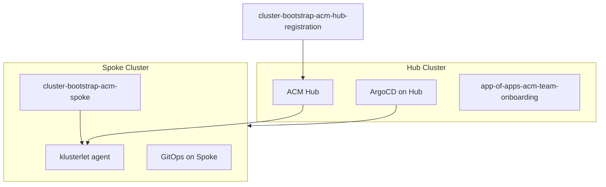

### Spoke registration sequence

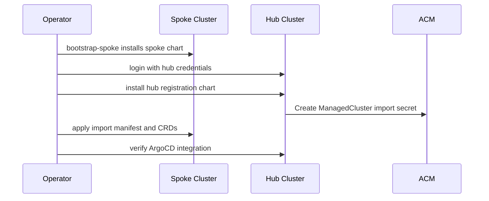

### Operations

| Action | Command |
|--------|---------|
| Hub bootstrap | `make cluster.<hub>.bootstrap` (with `acm_mode = hub`) |
| Spoke bootstrap | `make cluster.<spoke>.bootstrap-spoke HUB_CREDENTIALS_SECRET=<secret> ACM_REGION=<region>` |
| Spoke teardown | `make cluster.<spoke>.teardown-spoke HUB_CREDENTIALS_SECRET=<secret> ACM_REGION=<region>` |

Hub credentials are stored in AWS Secrets Manager. The spoke bootstrap script reads hub credentials from the secret named in `HUB_CREDENTIALS_SECRET`.

**Known limitation:** `acm_mode` is defined in the cluster module ([01-variables.tf](../../modules/infrastructure/cluster/01-variables.tf)) but not yet exposed in root [terraform/10-main.tf](../../terraform/10-main.tf). Set it in your fork's module call or extend root variable passthrough. Example cluster directories named `dev-hub-1` / `dev-spoke-1` default to `noacm` unless you configure `acm_mode` explicitly; `bootstrap-spoke` overrides `ACM_MODE=spoke` at runtime via the Makefile.

---

## 7. Organization-Specific Customization Checklist

Complete this checklist before your first production deployment:

- [ ] Create an OCM service account in Hybrid Cloud Console; add to User Access group with **Cluster Provisioner** (or equivalent) role
- [ ] Use `RHCS_CLIENT_ID` + `RHCS_CLIENT_SECRET` for Terraform and CI/CD — not a personal offline token
- [ ] After cluster creation: add **notification contact** email addresses for service logs
- [ ] After cluster creation: add platform team **users** to User Access groups with appropriate OCM management roles
- [ ] Replace `gitops_git_repo_url` with your cluster-config repository URL
- [ ] Create matching `gitops_git_path` directory in cluster-config (`<env>/<cluster-name>/`)
- [ ] Fork Helm charts; publish to your Helm repository; update `helm_repo_url`
- [ ] Replace hardcoded `adGroup: PFAUTHAD` in [hub-values.yaml.tftpl](../../modules/infrastructure/cluster/templates/hub-values.yaml.tftpl) with your AD/LDAP group
- [ ] Pin OpenShift version (`openshift_version` in tfvars)
- [ ] Configure KMS, etcd encryption, and FIPS for production
- [ ] Set `tags` for cost allocation and governance
- [ ] Configure remote state bucket per security policy
- [ ] Set `enable_persistent_dns_domain` and `enable_termination_protection` per policy
- [ ] For egress-zero: plan CodeCommit mirroring — [egress-zero GitOps guide](../guides/egress-zero-gitops.md) (not fully automated in Terraform yet — tracked in internal `docs/TODO.md`)

---

## 8. Configuration Decision Guide

Cluster shape is defined entirely by `clusters/<name>/terraform.tfvars`. Example directories illustrate **variable combinations**, not a single choice from a menu. Network, egress, compute, and fleet settings compose independently.

### Network source (one choice)

This decision applies only to **where the VPC comes from**. It does not preclude egress-zero, AutoNode, ACM, or other options.

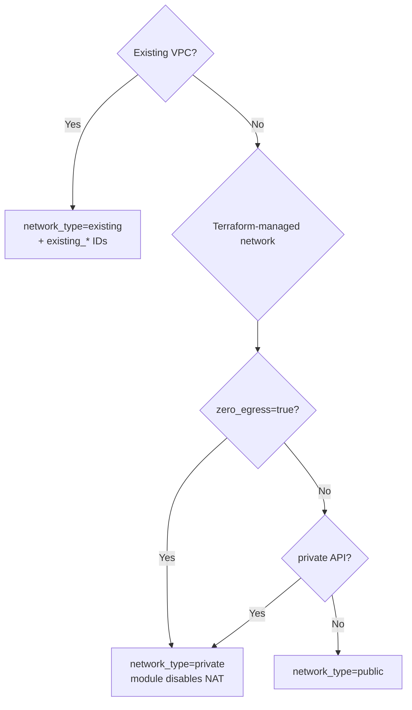

`zero_egress` and `private` are **separate variables** — they can be set on BYO VPC (`network_type = "existing"`) or Terraform-managed networks. See [terraform/01-variables.tf](../../terraform/01-variables.tf).

### Independent dimensions (combine freely)

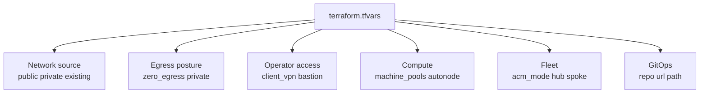

| Dimension | Variables | Combines with |
|-----------|-----------|---------------|
| Terraform-managed public | `network_type = "public"`, `zero_egress = false` | AutoNode, ACM, GitOps |
| Terraform-managed private | `network_type = "private"` | `zero_egress = true` for egress-zero |
| BYO VPC | `network_type = "existing"`, `existing_*` | `zero_egress = true`, AutoNode, GitOps |
| Zero egress | `zero_egress = true` | Any network source; needs VPC endpoints (+ CodeCommit for GitOps) |
| AutoNode | `enable_autonode = true` | Any network/egress combo; check version/region constraints |
| ACM hub/spoke | `acm_mode`, bootstrap target | Any network/egress combo |

### Network building blocks (reference)

```mermaid
flowchart LR
  subgraph publicNet [network_type=public]
    PubIGW[Internet Gateway]
    PubNAT[NAT Gateway]
    PubSubnets[Public + Private subnets]
  end

  subgraph privateNet [network_type=private]
    PrivPL[PrivateLink API]
    PrivNAT[NAT optional]
    PrivSubnets[Private subnets only]
  end

  subgraph egressOverlay [zero_egress=true overlay]
    EgressEP[VPC endpoints only]
    EgressNoNAT[No NAT]
  end

  subgraph byoNet [network_type=existing]
    ByoUser[User-managed VPC]
  end
```

| `network_type` | `zero_egress` | Typical API | Internet egress | Operator VPN |
|----------------|---------------|-------------|-----------------|--------------|
| `public` | `false` | Public | NAT | Usually no |
| `private` | `false` | PrivateLink | NAT | Sometimes |
| `private` | `true` | PrivateLink | VPC endpoints only | Yes |
| `existing` | `false` | Configurable | User-managed | Sometimes |
| `existing` | `true` | Configurable | VPC endpoints only | Yes |

### Multi-team state separation (optional)

For large organizations where network, IAM, and platform teams own separate Terraform state:

```mermaid
flowchart TB
  NetTeam[Network team state] -->|vpc_id subnet_ids| PlatTeam[Platform team state]
  IamTeam[IAM team state] -->|role ARNs OIDC| PlatTeam
  PlatTeam --> Cluster[ROSA HCP cluster]
```

See [README.md](../../README.md#multi-team-scenarios) for composition patterns using `TF_VAR_*` or shared tfvars.

---

## 9. CI/CD and Operational Model

Scripts under [scripts/cluster/](../../scripts/cluster/) are CI-friendly — pipelines do not require Make.

### Pipeline stages

```mermaid
flowchart LR
  PR[Pull request] --> FmtValidate[fmt validate lint]
  FmtValidate --> PlanJob[terraform plan]
  PlanJob --> Approval{Manual approval}
  Approval --> ApplyJob[terraform apply]
  ApplyJob --> BootstrapJob[bootstrap-gitops]
  BootstrapJob --> VerifyJob[verify_cluster.py]
```

Bootstrap runs as a **separate job** after apply — it needs cluster API access and Secrets Manager read permissions.

### Day 2 change flows

```mermaid
flowchart LR
  subgraph gitopsChanges [Kubernetes config]
    ConfigPR[cluster-config PR] --> ArgoSync[ArgoCD sync] --> ClusterK8s[Cluster resources]
  end

  subgraph infraChanges [AWS infrastructure]
    TfPR[terraform PR] --> TfApply[plan and apply] --> ClusterAWS[AWS resources]
  end
```

- **cluster-config changes** (apps, ingress, cert-manager): merge PR → ArgoCD syncs automatically
- **Terraform changes** (VPC, IAM, cluster version): plan → approve → apply

See [CI/CD guide](../guides/ci-cd.md) for GitHub Actions examples and secret configuration.

---

## 10. Troubleshooting and Known Limitations

### Troubleshooting decision tree

```mermaid
flowchart TD
  Failed[Bootstrap failed]
  Failed --> ReachGit{Can reach Git repos?}
  ReachGit -->|No| EgressFix[CodeCommit mirror or VPN]
  ReachGit -->|Yes| WorkersReady{Workers ready?}
  WorkersReady -->|No| WaitFix[Wait or adjust MIN_READY_WORKERS]
  WorkersReady -->|Yes| ChartMatch{Chart versions match Terraform pins?}
  ChartMatch -->|No| PinFix[Bump cluster-module chart variables or align helm fork]
  ChartMatch -->|Yes| CheckLogs[Check bootstrap script output and helm list -A]
```

### Common issues

| Issue | Cause | Workaround |
|-------|-------|------------|
| Bootstrap can't reach GitHub | Egress-zero or no VPC endpoints for Git | CodeCommit mirroring — [egress-zero GitOps guide](../guides/egress-zero-gitops.md) |
| CMP plugin apps stuck `Sync: Unknown` (`find: command not found` or plugin sidecar errors) | Repo-server CMP image missing tools or wrong/unreachable image | Use current `gitops-tools` image; re-host to private registry and set `gitops_tools_image` / `defaultImage` in bootstrap templates — [§3c GitOps CMP tools image](#gitops-cmp-tools-container-image) |
| Repo-server can't pull CMP sidecar image | `ghcr.io` blocked (egress-zero, registry policy) | Mirror `gitops-tools` to ECR; update `defaultImage` in [hub-values.yaml.tftpl](../../modules/infrastructure/cluster/templates/hub-values.yaml.tftpl) and [spoke-values.yaml.tftpl](../../modules/infrastructure/cluster/templates/spoke-values.yaml.tftpl) |
| Wrong cluster-config branch synced | `gitops_git_target_revision` still `HEAD` or chart older than `0.5.18` | Set `gitops_git_target_revision` in tfvars and use `cluster-bootstrap` >= `0.5.18` |
| Helm chart version mismatch | Terraform pin defaults out of sync with published Helm repo or Gitea upload | Bump defaults in [cluster `01-variables.tf`](../../modules/infrastructure/cluster/01-variables.tf) (`helm_chart_version`, `app_of_apps_*_chart_version`, etc.); see §3c version pinning table. For `bootstrap-private`, values are also patched from `reference/validated-pattern-helm-charts` `Chart.yaml` when the clone is ahead. |
| ACM examples default to `noacm` | `acm_mode` not in example tfvars | Set module variable; use `bootstrap-spoke` target |
| Worker nodes not ready | Bootstrap waits for ≥2 Ready workers on single-AZ (60 min timeout for `.metal`); long NotReady on bare metal may need `default_auto_repair = false` | Set in `terraform.tfvars`; override `WORKER_READY_MAX_ATTEMPTS` if needed |
| Cluster login fails (private) | No VPN to private API | Start Client VPN: `make cluster.<name>.vpn-start` |

### Recommended follow-ups (not yet in Terraform)

These improvements are documented as future work:

- Expose `helm_repo_url` and chart version pins at root `terraform.tfvars` (optional overrides without forking the cluster module; `acm_mode` is already at root)
- Automate CodeCommit repository creation and mirroring (see internal `docs/TODO.md`)

---

## 11. Appendices

### A. GitOps-linking variables

**Root module** ([terraform/01-variables.tf](../../terraform/01-variables.tf)) — set in `clusters/<name>/terraform.tfvars`:

| Variable | Description | Example |
|----------|-------------|---------|
| `enable_cluster_admin` | Long-lived break-glass HTPasswd admin + Secrets Manager (default `false`; examples set `true`) | `true` |
| `enable_gitops_bootstrap` | Enable bootstrap outputs and script | `true` |
| `gitops_git_repo_url` | cluster-config repository URL | `https://github.com/<org>/acme-cluster-config.git` |
| `gitops_git_path` | Path under repo root | `dev/acme-dev` |
| `gitops_git_target_revision` | Git branch/tag/commit for cluster-config values source (`gitTargetRevision`) | `HEAD` or `feature/my-branch` |
| `acm_mode` | ACM bootstrap mode | `noacm`, `hub`, or `spoke` |

**Cluster module only** ([modules/infrastructure/cluster/01-variables.tf](../../modules/infrastructure/cluster/01-variables.tf)) — set via fork or extend root passthrough:

| Variable | Default | Description |
|----------|---------|-------------|
| `helm_repo_url` | `https://rh-mobb.github.io/validated-pattern-helm-charts/` | Your published Helm repo |
| `helm_chart_version` | `0.5.19` | `cluster-bootstrap` chart version |
| `helm_chart_acm_spoke_version` | `0.6.14` | `cluster-bootstrap-acm-spoke` chart version |
| `helm_chart_acm_hub_registration_version` | `0.2.2` | `cluster-bootstrap-acm-hub-registration` chart version |
| `helm_chart_awspca_version` | `1.6.1` | `aws-privateca-issuer` chart version |
| `app_of_apps_infrastructure_chart_version` | `0.3.0` | `app-of-apps-infrastructure` `targetRevision` in hub bootstrap values |
| `app_of_apps_application_chart_version` | `1.5.8` | `app-of-apps-application` `targetRevision` (non-hub `acm_mode`) |
| `app_of_apps_acm_team_onboarding_chart_version` | `0.4.1` | `app-of-apps-acm-team-onboarding` `targetRevision` (hub `acm_mode`) |
| `gitops_tools_image` | `ghcr.io/rh-mobb/validated-pattern-terraform-rosa/gitops-tools:latest` | Optional CMP repo-server sidecar tooling image (used when `plugin: true`); re-host for egress-zero or registry policy — see [§3c](#gitops-cmp-tools-container-image) |
| `gitops_csv` | `openshift-gitops-operator.v1.19.2` | GitOps operator CSV |
| `hub_credentials_secret_name` | `""` | Hub secret for spoke mode |
| `acm_region` | `""` | Hub region for spoke mode |

### B. Terraform bootstrap outputs

From [terraform/90-outputs.tf](../../terraform/90-outputs.tf):

| Output | Purpose |
|--------|---------|
| `gitops_bootstrap_enabled` | Whether bootstrap is enabled |
| `gitops_bootstrap_acm_mode` | `hub`, `spoke`, or `noacm` |
| `gitops_bootstrap_hub_values` | YAML for hub/standalone bootstrap |
| `gitops_bootstrap_spoke_values` | YAML for spoke bootstrap |
| `gitops_bootstrap_env_exports` | Shell `export` statements for bootstrap |
| `gitops_bootstrap_script_path` | Path to `bootstrap-gitops.sh` |
| `admin_user_created` | Whether break-glass HTPasswd admin IDP exists |
| `cluster_credentials_secret_arn` | Secrets Manager ARN for break-glass credentials JSON (null if disabled) |
| `cluster_domain` | Cluster domain for Helm values |

### C. Makefile quick reference

```bash
make cluster.<name>.init              # Initialize Terraform
make cluster.<name>.plan              # Plan changes
make cluster.<name>.apply             # Apply infrastructure
make cluster.<name>.bootstrap         # Bootstrap GitOps (hub/standalone)
make cluster.<name>.bootstrap-spoke   # Bootstrap as ACM spoke
make cluster.<name>.teardown-spoke      # Remove spoke from ACM hub
make cluster.<name>.verify            # Verify GitOps deployment
make cluster.<name>.login             # oc login (requires enable_cluster_admin)
make cluster.<name>.show-endpoints      # API and console URLs
make cluster.<name>.show-credentials    # Break-glass admin credentials (if enabled)
make cluster.<name>.destroy             # Destroy all resources
make cluster.<name>.sleep               # Sleep cluster (preserve DNS/IAM)
make cluster.<name>.vpn-start           # Start Client VPN (private clusters)
```

### D. Upstream source repositories

| Purpose | URL |
|---------|-----|
| Infrastructure (this repo) | Your fork of `vp-terraform-rosa` |
| cluster-config | https://github.com/rh-mobb/rosa-cluster-config |
| Helm charts | https://github.com/rh-mobb/validated-pattern-helm-charts |
| RHCS Terraform provider | https://registry.terraform.io/providers/terraform-redhat/rhcs |
| ROSA HCP docs | https://docs.redhat.com/en/documentation/red_hat_openshift_service_on_aws/ |

### E. Related documentation

- [README.md](../../README.md) — Project overview and quick start
- [Authentication](../getting-started/authentication.md) — Break-glass vs short-lived bootstrap login
- [Quick Start](../getting-started/quick-start.md) — First public cluster walkthrough
- [PLAN.md](../../PLAN.md) — Architecture decisions and implementation plan
- [clusters/README.md](../../clusters/README.md) — Cluster directory patterns
- [scripts/cluster/README-bootstrap-gitops.md](../../scripts/cluster/README-bootstrap-gitops.md) — Bootstrap script reference
- [egress-zero GitOps guide](../guides/egress-zero-gitops.md) — GitOps for zero-egress clusters
- [CI/CD guide](../guides/ci-cd.md) — Pipeline integration
