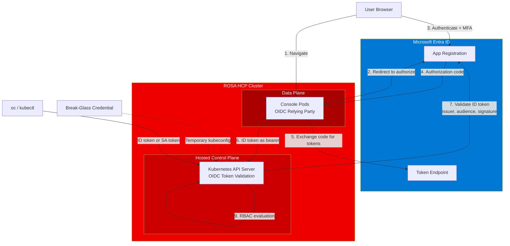
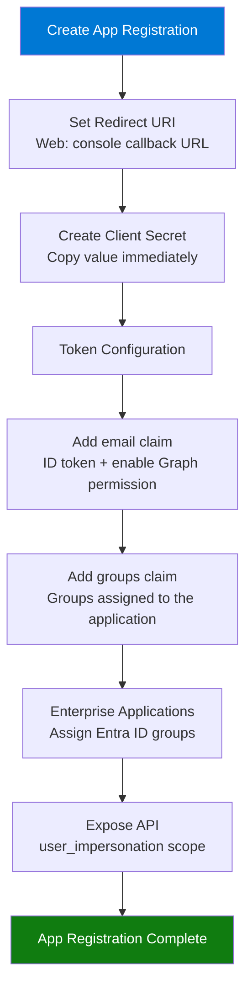
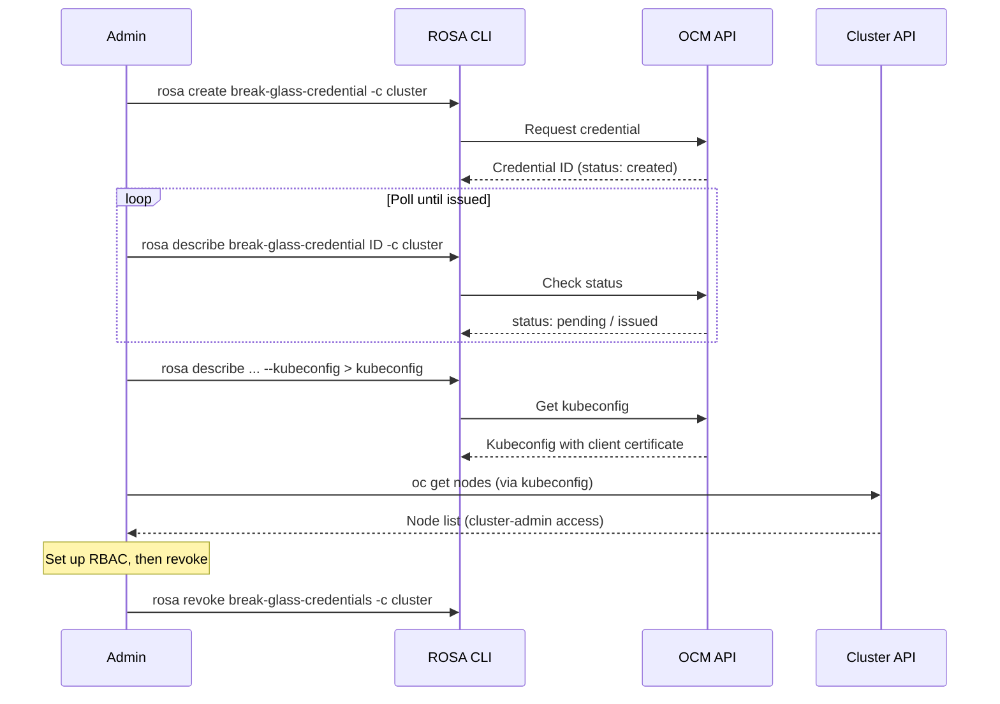
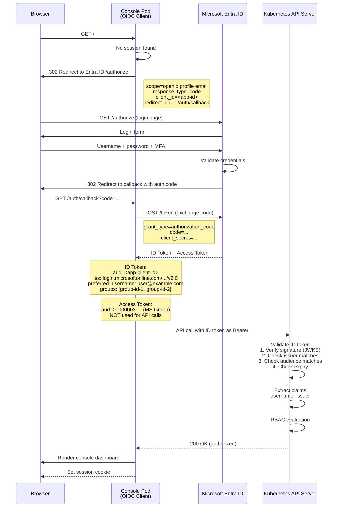
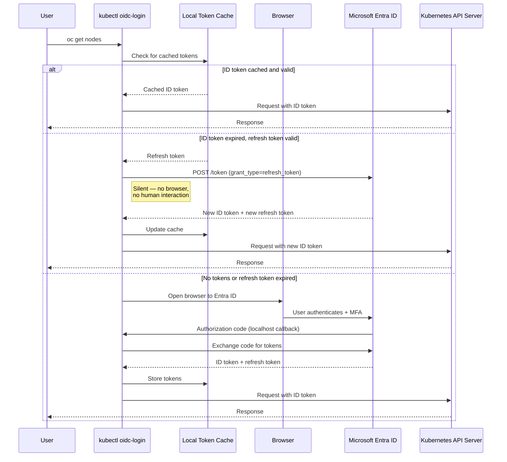

# External Authentication with Microsoft Entra ID

Configure ROSA HCP to use Microsoft Entra ID (Azure AD) as the sole identity provider, replacing the internal OAuth server entirely. Users authenticate via corporate SSO; cluster access is governed by Entra ID groups mapped to OpenShift RBAC.

**Key constraints:**

- External auth must be enabled **at cluster creation** (`--external-auth-providers-enabled`) — it cannot be added to existing clusters
- There is **no internal OAuth server** and **no default admin account** — break-glass credentials provide temporary access for initial RBAC setup
- Only **one** external auth provider is supported per cluster

---

## Architecture



---

## Prerequisites

| Requirement | Notes |
|-------------|-------|
| ROSA HCP cluster | Created with `--external-auth-providers-enabled` |
| Azure tenant | Admin access to App Registrations and Enterprise Applications |
| `rosa` CLI | >= 1.2.36 |
| `ocm` CLI | OCM CLI — required for the `extra_scopes` patch ([install](https://console.redhat.com/openshift/downloads#tool-ocm-api)) |
| `oc` CLI | OpenShift CLI |
| `az` CLI | Azure CLI (for verification) |
| `jq` | JSON processor |
| `kubectl krew` | Plugin manager (for oidc-login, optional) |

---

## Entra ID App Registration

### Step 1: Register the application

1. Azure Portal → **App registrations** → **New registration**
2. Name: `<cluster-name>-auth` (e.g., `rhai-auth`)
3. Supported account types: **Single tenant** (this organization only)
4. Redirect URI: Select **Web**, enter your console callback URL:

```
https://console-openshift-console.apps.rosa.<cluster-name>.<hash>.p3.openshiftapps.com/auth/callback
```

Get the exact URL after cluster creation:

```bash
rosa describe cluster -c <cluster-name> | grep "Console URL"
```

Append `/auth/callback` to the console URL.

5. Click **Register**

### Step 2: Create a client secret

1. **Certificates & secrets** → **New client secret**
2. Copy the **Value** immediately (shown only once)
3. Note the **Application (client) ID** and **Directory (tenant) ID** from the **Overview** blade

### Step 3: Configure token claims

1. **Token configuration** → **Add optional claim**
2. Token type: **ID** → check **email** → click **Add**
3. When prompted, tick **"Turn on the Microsoft Graph email permission"**
4. **Add groups claim** → select **"Groups assigned to the application"**



### Step 4: Assign groups

1. **Enterprise Applications** → find your app → **Users and groups** → **Add user/group**
2. Select the Entra ID groups that should have cluster access
3. Note the **Object ID** of each group (needed for ClusterRoleBindings)

### Step 5: Expose an API (may not be required — needs testing)

1. **Expose an API** → Set Application ID URI: `api://<client-id>`
2. **Add a scope**: name `user_impersonation`, admin consent, enabled
3. **API permissions** → **Add a permission** → **My APIs** → select your app → `user_impersonation`
4. **Grant admin consent** for the tenant

### Step 6: Set access token version (may not be required — needs testing)

1. **Manifest** → set `"accessTokenAcceptedVersion": 2` → **Save**

> **Note:** Steps 5 and 6 were performed during initial troubleshooting. The actual fix was the OCM API patch setting `extra_scopes: ["profile"]`. These steps may not be necessary — testing with a clean app registration without them is recommended to confirm.

### Verification

```bash
az ad app show --id <client-id> --query "{displayName:displayName,identifierUris:identifierUris,accessTokenVersion:api.requestedAccessTokenVersion}" -o table
```

---

## ROSA External Auth Provider

### Set environment variables

```bash
export IDP_NAME=<app-name>                    # e.g., entraid
export CLIENT_ID=<application-client-id>      # from App Registration Overview
export CLIENT_SECRET="<client-secret-value>"  # from Certificates & secrets
export TENANT_ID=<directory-tenant-id>        # from App Registration Overview
export ROSA_CLUSTER_NAME=<cluster-name>       # e.g., rhai
export GROUP_ID=<entra-group-object-id>       # from Azure Groups
```

### Create the provider

```bash
rosa create external-auth-provider \
  --cluster=${ROSA_CLUSTER_NAME} \
  --name=${IDP_NAME} \
  --issuer-url=https://login.microsoftonline.com/${TENANT_ID}/v2.0 \
  --issuer-audiences=${CLIENT_ID} \
  --claim-mapping-username-claim=preferred_username \
  --claim-mapping-groups-claim=groups \
  --console-client-id=${CLIENT_ID} \
  --console-client-secret=${CLIENT_SECRET}
```

> If your Entra ID users have an `email` attribute populated, use `--claim-mapping-username-claim=email` instead (per Red Hat's recommendation). Use `preferred_username` if users lack the `email` property.

The provider takes several minutes to become active.

### Critical: Set `profile` extra scope via OCM API

Without this step, the console enters an infinite login loop. The console needs the `profile` scope to correctly use the ID token for API server authentication.

```bash
CLUSTER_ID=$(rosa describe cluster -c ${ROSA_CLUSTER_NAME} -o json | jq -r '.id')

cat > /tmp/ocm-patch.json <<EOF
{
  "clients": [{
    "id": "${CLIENT_ID}",
    "secret": "${CLIENT_SECRET}",
    "component": {
      "name": "console",
      "namespace": "openshift-console"
    },
    "extra_scopes": ["profile"]
  }]
}
EOF

ocm patch /api/clusters_mgmt/v1/clusters/${CLUSTER_ID}/external_auth_config/external_auths/${IDP_NAME} \
  --body=/tmp/ocm-patch.json
```

> **Why is this needed?** The OpenShift console acts as an OIDC relying party. Without the `profile` extra scope, the console sends the OAuth2 access token (which Azure scopes to Microsoft Graph) to the Kubernetes API server. The API server rejects it because the audience is `00000003-0000-0000-c000-000000000000` (Graph), not the app's client ID. Adding `profile` as an extra scope causes the console to use the **ID token** instead, which has the correct audience, issuer, and claims.

### Verify the provider

```bash
rosa describe external-auth-provider ${IDP_NAME} -c ${ROSA_CLUSTER_NAME}
```

### Verify the cluster configuration

```bash
oc get authentication.config.openshift.io cluster -o json | \
  jq '.spec.oidcProviders[0] | {name, issuer, claimMappings, oidcClients}'
```

Confirm `extraScopes` contains `["profile"]` in the console client.

---

## Break-Glass Credentials

With external auth enabled, there is no default admin account. Break-glass credentials provide temporary cluster-admin access via a kubeconfig file (maximum 24 hours).



### Dependency on console.redhat.com

The `rosa` CLI authenticates to the OCM API via a service account token or offline token from [console.redhat.com](https://console.redhat.com). Break-glass credentials are issued by OCM, **not** by Entra ID — so they remain available even if Entra ID is unreachable.

However, if your organization federates console.redhat.com login through Entra ID (SSO), and Entra ID is down, you may not be able to authenticate to `rosa` CLI to create new break-glass credentials. To mitigate this:

- Use a **Red Hat service account** (`RHCS_CLIENT_ID` / `RHCS_CLIENT_SECRET`) for the `rosa` CLI instead of an interactive login — service account tokens do not go through Entra ID
- Pre-generate a long-lived **offline token** from [console.redhat.com/openshift/token](https://console.redhat.com/openshift/token/rosa/show) while Entra ID is available, and store it securely
- Once console.redhat.com is configured for Entra ID federation, confirm that `rosa login` with a service account still works independently of Entra ID availability

### Create and use a break-glass credential

```bash
# Create (valid for 24 hours)
rosa create break-glass-credential --cluster=${ROSA_CLUSTER_NAME}

# Get the credential ID
BG_ID=$(rosa list break-glass-credential --cluster=${ROSA_CLUSTER_NAME} -o json | jq -r '.[-1].id')

# Poll until issued (typically 2-5 minutes, can take up to 10)
rosa describe break-glass-credential ${BG_ID} --cluster=${ROSA_CLUSTER_NAME}

# Export kubeconfig
rosa describe break-glass-credential ${BG_ID} \
  --cluster=${ROSA_CLUSTER_NAME} \
  --kubeconfig > break-glass.kubeconfig

# Use it
export KUBECONFIG=break-glass.kubeconfig
oc whoami
oc get nodes
```

### Set up RBAC

```bash
# Bind an Entra ID group to cluster-admin
oc create clusterrolebinding entraid-cluster-admins \
  --clusterrole=cluster-admin \
  --group=${GROUP_ID}

# Optionally bind a specific user
oc create clusterrolebinding entraid-admin-user \
  --clusterrole=cluster-admin \
  --user=user@example.com
```

### Revoke credentials

```bash
rosa revoke break-glass-credentials --cluster=${ROSA_CLUSTER_NAME} --yes
```

---

## Console Login Flow

When a user navigates to the OpenShift console, the following sequence occurs:



### Token analysis

The OIDC flow returns two tokens. Only the **ID token** is used for cluster authentication.

**ID Token** (used by console and API server):

```
aud: <app-client-id>                    ← matches issuer-audiences
iss: https://login.microsoftonline.com/<tenant-id>/v2.0   ← matches issuer-url
ver: 2.0
groups: ["<group-object-id>"]           ← mapped via --claim-mapping-groups-claim
preferred_username: user@example.com    ← mapped via --claim-mapping-username-claim
name: User Name
```

**Access Token** (issued for Microsoft Graph, not used):

```
aud: 00000003-0000-0000-c000-000000000000   ← Microsoft Graph
iss: https://sts.windows.net/<tenant-id>/   ← v1.0 format
ver: 1.0
scp: openid profile email
```

The API server constructs the username as `<issuer-url>#<username-claim-value>`:

```
https://login.microsoftonline.com/<tenant-id>/v2.0#user@example.com
```

### Verify with TokenReview

```bash
# Using break-glass kubeconfig, validate an ID token:
cat <<EOF | oc create -f - -o json | jq '.status'
apiVersion: authentication.k8s.io/v1
kind: TokenReview
spec:
  token: "<paste-id-token-here>"
EOF
```

Expected output:

```json
{
  "authenticated": true,
  "user": {
    "username": "https://login.microsoftonline.com/<tenant>/v2.0#user@example.com",
    "groups": ["<group-id>", "system:authenticated"]
  }
}
```

---

## CLI Login with oidc-login

The `oidc-login` kubectl plugin provides persistent CLI access using Entra ID credentials. It uses the standard OAuth2 authorization code flow with local token caching and automatic refresh — no need to manage tokens manually.

### How token lifecycle works

The kubeconfig uses an `exec` credential plugin. Every time `oc` or `kubectl` runs a command, `oidc-login get-token` is invoked automatically. It manages three states:

1. **First run (no cached token):** Opens a browser for interactive Entra ID login. Receives an ID token (~1 hour) and a refresh token (~90 days). Both are cached locally.
2. **Subsequent runs (ID token still valid):** Returns the cached ID token immediately. No network call, no human interaction.
3. **ID token expired, refresh token valid:** Silently exchanges the refresh token for a new ID token via the Entra ID token endpoint. No browser, no human interaction. This happens transparently — the user sees no difference from a cache hit.
4. **Refresh token expired:** Opens the browser again for interactive login (once every ~90 days).

The kubeconfig itself never changes — it always points to the `oidc-login get-token` exec plugin. The plugin handles all token acquisition, caching, and refresh internally.



In practice, a user authenticates interactively once, then has hands-free CLI access for the lifetime of the refresh token (up to 90 days by default). The token lifetime is controlled by Entra ID policies — see [Token lifetime control](#token-lifetime-control) below.

### Install

Krew and oidc-login support **Linux, macOS, and Windows**. The install script auto-detects the OS and architecture.

```bash
# Install krew (Linux / macOS)
(
  set -x; cd "$(mktemp -d)" &&
  OS="$(uname | tr '[:upper:]' '[:lower:]')" &&
  ARCH="$(uname -m | sed -e 's/x86_64/amd64/' -e 's/aarch64$/arm64/')" &&
  KREW="krew-${OS}_${ARCH}" &&
  curl -fsSLO "https://github.com/kubernetes-sigs/krew/releases/latest/download/${KREW}.tar.gz" &&
  tar zxvf "${KREW}.tar.gz" &&
  ./"${KREW}" install krew
)

# Add to PATH (~/.zshrc or ~/.bashrc)
export PATH="${KREW_ROOT:-$HOME/.krew}/bin:$PATH"

# Install oidc-login
kubectl krew install oidc-login
```

### Install in an EKS pod (CI/CD runner)

For CI/CD pipelines running in EKS pods (e.g., Jenkins agents, GitLab runners), install `oc`, krew, and the oidc-login plugin in the container image or as an init step. Since there is no browser in the pod, use the **device code flow** for authentication.

**Dockerfile (custom CI runner image):**

```dockerfile
FROM amazonlinux:2023

# Install oc CLI
RUN curl -LO "https://mirror.openshift.com/pub/openshift-v4/clients/ocp/latest/openshift-client-linux.tar.gz" && \
    tar xzf openshift-client-linux.tar.gz && \
    mv oc kubectl /usr/local/bin/ && \
    rm -f openshift-client-linux.tar.gz

# Install krew + oidc-login
RUN ( \
      set -x; cd "$(mktemp -d)" && \
      OS="$(uname | tr '[:upper:]' '[:lower:]')" && \
      ARCH="$(uname -m | sed -e 's/x86_64/amd64/' -e 's/aarch64$/arm64/')" && \
      KREW="krew-${OS}_${ARCH}" && \
      curl -fsSLO "https://github.com/kubernetes-sigs/krew/releases/latest/download/${KREW}.tar.gz" && \
      tar zxvf "${KREW}.tar.gz" && \
      ./"${KREW}" install krew \
    )

ENV PATH="${KREW_ROOT:-/root/.krew}/bin:${PATH}"
RUN kubectl krew install oidc-login
```

**Or as a pipeline init step (ephemeral pods):**

```bash
# Install oc CLI
curl -sLO "https://mirror.openshift.com/pub/openshift-v4/clients/ocp/latest/openshift-client-linux.tar.gz"
tar xzf openshift-client-linux.tar.gz && mv oc kubectl /usr/local/bin/

# Install krew + oidc-login
(
  set -x; cd "$(mktemp -d)" &&
  OS="$(uname | tr '[:upper:]' '[:lower:]')" &&
  ARCH="$(uname -m | sed -e 's/x86_64/amd64/' -e 's/aarch64$/arm64/')" &&
  KREW="krew-${OS}_${ARCH}" &&
  curl -fsSLO "https://github.com/kubernetes-sigs/krew/releases/latest/download/${KREW}.tar.gz" &&
  tar zxvf "${KREW}.tar.gz" &&
  ./"${KREW}" install krew
)
export PATH="${KREW_ROOT:-$HOME/.krew}/bin:$PATH"
kubectl krew install oidc-login
```

> **Note on token caching:** With `--token-cache-storage=disk`, the cached refresh token must persist between pipeline runs. Mount a PersistentVolume or EBS volume to the runner pod at the cache directory (default `~/.kube/cache/oidc-login/`). If using ephemeral pods without persistent storage, the device code authentication is required on every run — consider the ROPC flow or ServiceAccount tokens instead.

Use the device code kubeconfig (see [Device code flow](#device-code-flow-headless--no-browser-on-the-server) below) or the [Programmatic Token Acquisition](#programmatic-token-acquisition) section for fully non-interactive access via `curl`.

### Create kubeconfig

```bash
API_URL=$(rosa describe cluster -c ${ROSA_CLUSTER_NAME} -o json | jq -r '.api.url')

cat > rosa-oidc.kubeconfig <<EOF
apiVersion: v1
clusters:
- cluster:
    server: ${API_URL}
  name: ${ROSA_CLUSTER_NAME}
contexts:
- context:
    cluster: ${ROSA_CLUSTER_NAME}
    user: entraid
  name: ${ROSA_CLUSTER_NAME}
current-context: ${ROSA_CLUSTER_NAME}
kind: Config
users:
- name: entraid
  user:
    exec:
      apiVersion: client.authentication.k8s.io/v1beta1
      command: kubectl
      args:
      - oidc-login
      - get-token
      - --oidc-issuer-url=https://login.microsoftonline.com/${TENANT_ID}/v2.0
      - --oidc-client-id=${CLIENT_ID}
      - --oidc-client-secret=${CLIENT_SECRET}
      - --oidc-extra-scope=profile
EOF

export KUBECONFIG=rosa-oidc.kubeconfig
oc whoami
```

### Device code flow (headless / no browser on the server)

For servers or CI environments without a browser. The command outputs a one-time code and URL — a human opens `https://microsoft.com/devicelogin` in **any** browser (laptop, phone, etc.), enters the code, and authenticates. The server receives the token without ever opening a browser locally.

**Prerequisite:** Enable **"Allow public client flows"** in Azure portal → App Registration → Authentication → Advanced settings.

On first run (and every ~90 days when the refresh token expires):

```
$ oc whoami
Please enter the following code when asked in your browser: BV8FCB26U
# Open https://microsoft.com/devicelogin on any device, enter the code, authenticate
# The command completes automatically once the code is entered
```

After the initial authentication, the token is cached and subsequent runs are fully automatic — no code, no browser.

```bash
cat > rosa-oidc-headless.kubeconfig <<EOF
apiVersion: v1
clusters:
- cluster:
    server: ${API_URL}
  name: ${ROSA_CLUSTER_NAME}
contexts:
- context:
    cluster: ${ROSA_CLUSTER_NAME}
    user: entraid-headless
  name: ${ROSA_CLUSTER_NAME}
current-context: ${ROSA_CLUSTER_NAME}
kind: Config
users:
- name: entraid-headless
  user:
    exec:
      apiVersion: client.authentication.k8s.io/v1beta1
      command: kubectl
      args:
      - oidc-login
      - get-token
      - --oidc-issuer-url=https://login.microsoftonline.com/${TENANT_ID}/v2.0
      - --oidc-client-id=${CLIENT_ID}
      - --oidc-client-secret=${CLIENT_SECRET}
      - --oidc-extra-scope=profile
      - --grant-type=device-code
      - --token-cache-storage=disk
EOF
```

### Token lifetime control

By default, Entra ID issues ID tokens valid for approximately 1 hour. To enforce shorter (or longer) lifetimes, create a **Token Lifetime Policy** in Entra ID and assign it to the app registration's service principal.

```bash
# Create a policy (e.g., 30-minute access token lifetime)
POLICY_ID=$(az rest --method POST \
  --uri "https://graph.microsoft.com/v1.0/policies/tokenLifetimePolicies" \
  --body '{
    "definition": ["{\"TokenLifetimePolicy\":{\"Version\":1,\"AccessTokenLifetime\":\"00:30:00\"}}"],
    "displayName": "ShortLivedTokenPolicy",
    "isOrganizationDefault": false
  }' --query id -o tsv)

# Get the service principal object ID for your app
SP_ID=$(az ad sp show --id ${CLIENT_ID} --query id -o tsv)

# Assign the policy to the service principal
az rest --method POST \
  --uri "https://graph.microsoft.com/v1.0/servicePrincipals/${SP_ID}/tokenLifetimePolicies/\$ref" \
  --body "{\"@odata.id\": \"https://graph.microsoft.com/v1.0/policies/tokenLifetimePolicies/${POLICY_ID}\"}"
```

This affects all tokens issued for the app — both console and CLI sessions. Shorter lifetimes improve security but require more frequent re-authentication. The `oidc-login` plugin handles token refresh automatically using the refresh token (valid for up to 90 days by default).

| Setting | Default | Configurable range |
|---------|---------|-------------------|
| Access/ID token lifetime | ~1 hour | 10 minutes – 1 day |
| Refresh token lifetime | 90 days | Up to 90 days |
| Refresh token inactivity | 90 days | Up to 90 days |

See [Microsoft: Configurable token lifetimes](https://learn.microsoft.com/en-us/entra/identity-platform/configurable-token-lifetimes) for full details.

---

## Programmatic Token Acquisition

Obtain an ID token directly from Entra ID using `curl` and `oc login`. **No plugins required** — only `curl`, `jq`, and `oc` are needed. This is the lightest-weight approach for scripts, automation, CI/CD pipelines, and environments where krew / oidc-login cannot be installed.

### Resource Owner Password Credentials (ROPC) flow

ROPC is an OAuth2 grant type where the application sends the user's username and password directly to the Entra ID token endpoint — no browser redirect, no interactive login page. The token endpoint returns an ID token and access token in a single HTTP response, making it the simplest flow for scripts and automation.

**Trade-offs and limitations:**

| Consideration | Detail |
|---------------|--------|
| No MFA support | ROPC bypasses the interactive login flow, so multi-factor authentication cannot be triggered. Fails if MFA is enforced on the user. |
| Tenant restrictions | Many Entra ID tenants disable ROPC by default via Conditional Access policies. Check with your Azure AD admin. |
| Credential exposure | The calling application handles the user's raw password. Any compromise of the script or CI system exposes the credentials. |
| Microsoft discourages it | [Microsoft recommends](https://learn.microsoft.com/en-us/entra/identity-platform/v2-oauth-ropc) against ROPC in production. It exists primarily for legacy/migration scenarios. |
| Federated users | Does not work for users who authenticate via a federated identity provider (e.g., ADFS). Only works for cloud-native Entra ID accounts. |
| No Conditional Access | Conditional Access policies (device compliance, location-based access) are not evaluated. |

Use ROPC only when the device code flow is not feasible and the user account has MFA disabled.

```bash
RESPONSE=$(curl -s -X POST \
  "https://login.microsoftonline.com/${TENANT_ID}/oauth2/v2.0/token" \
  -H "Content-Type: application/x-www-form-urlencoded" \
  -d "grant_type=password" \
  -d "client_id=${CLIENT_ID}" \
  -d "client_secret=${CLIENT_SECRET}" \
  -d "username=user@example.com" \
  -d "password=<user-password>" \
  -d "scope=openid profile")

# Extract the ID token
ID_TOKEN=$(echo "$RESPONSE" | jq -r '.id_token')

# Login to OpenShift
oc login --token="${ID_TOKEN}" --server=${API_URL}
```

### Device code flow (headless)

Works when ROPC is blocked or MFA is required. Requires one-time human interaction to enter the device code.

```bash
# Step 1: Request a device code
DEVICE_RESPONSE=$(curl -s -X POST \
  "https://login.microsoftonline.com/${TENANT_ID}/oauth2/v2.0/devicecode" \
  -H "Content-Type: application/x-www-form-urlencoded" \
  -d "client_id=${CLIENT_ID}" \
  -d "scope=openid profile")

echo "$DEVICE_RESPONSE" | jq -r '.message'
# Output: "To sign in, use a web browser to open https://microsoft.com/devicelogin
#          and enter the code XXXXXXXX to authenticate."

DEVICE_CODE=$(echo "$DEVICE_RESPONSE" | jq -r '.device_code')

# Step 2: User opens browser and enters code (human step)

# Step 3: Poll for token completion
RESPONSE=$(curl -s -X POST \
  "https://login.microsoftonline.com/${TENANT_ID}/oauth2/v2.0/token" \
  -H "Content-Type: application/x-www-form-urlencoded" \
  -d "grant_type=urn:ietf:params:oauth:grant-type:device_code" \
  -d "client_id=${CLIENT_ID}" \
  -d "device_code=${DEVICE_CODE}")

ID_TOKEN=$(echo "$RESPONSE" | jq -r '.id_token')
oc login --token="${ID_TOKEN}" --server=${API_URL}
```

---

## CI/CD Pipeline Access

### Option 1: oidc-login with device code flow (recommended)

Uses the same Entra ID identity and RBAC as interactive users. All cluster access flows through the corporate identity provider, maintaining a consistent audit trail. The CI runner authenticates via the device code flow, and the `oidc-login` plugin caches the refresh token on disk for automatic, non-interactive token renewal on subsequent runs.

**One-time setup on the CI runner:**

```bash
# Install krew + oidc-login (see Install in an EKS pod section above)
kubectl krew install oidc-login
```

**Create a dedicated Entra ID service user:**

1. Create a user in Entra ID for the pipeline (e.g., `jenkins-ci@tenant.com`)
2. Assign it to the appropriate group in the Enterprise Application
3. Enable **"Allow public client flows"** in the app registration (Authentication → Advanced settings)

**Create the kubeconfig on the CI runner:**

```bash
cat > ci-kubeconfig <<EOF
apiVersion: v1
clusters:
- cluster:
    server: ${API_URL}
  name: ${ROSA_CLUSTER_NAME}
contexts:
- context:
    cluster: ${ROSA_CLUSTER_NAME}
    user: entraid-ci
  name: ${ROSA_CLUSTER_NAME}
current-context: ${ROSA_CLUSTER_NAME}
kind: Config
users:
- name: entraid-ci
  user:
    exec:
      apiVersion: client.authentication.k8s.io/v1beta1
      command: kubectl
      args:
      - oidc-login
      - get-token
      - --oidc-issuer-url=https://login.microsoftonline.com/${TENANT_ID}/v2.0
      - --oidc-client-id=${CLIENT_ID}
      - --oidc-client-secret=${CLIENT_SECRET}
      - --oidc-extra-scope=profile
      - --grant-type=device-code
      - --token-cache-storage=disk
EOF
```

**How it works in a pipeline:**

The device code flow does not need a browser on the CI runner itself. When the token cache is empty or the refresh token has expired, `oidc-login` outputs a device code and URL to the pipeline's console log, then blocks until a human enters the code in any browser (their laptop, phone, etc.). Once authenticated, the token is cached and subsequent runs are fully automatic.

```
# Pipeline console output when authentication is needed:
Please enter the following code when asked in your browser: BV8FCB26U
Open https://microsoft.com/devicelogin
```

**Jenkins pipeline example:**

```groovy
pipeline {
    agent any
    stages {
        stage('Authenticate & Deploy') {
            steps {
                sh '''
                    export KUBECONFIG=/var/jenkins/ci-kubeconfig
                    echo "Authenticating to ROSA cluster..."
                    # If token cache is valid, this completes instantly.
                    # If expired, a device code appears in the build log —
                    # a human enters it at https://microsoft.com/devicelogin
                    # and the pipeline continues automatically.
                    oc whoami
                    echo "Deploying..."
                    oc apply -f manifests/
                '''
            }
        }
    }
}
```

**Seed the token cache (one-time setup):**

Run any `oc` command on the CI runner with the kubeconfig set. Follow the device code prompt — open a browser anywhere, enter the code, authenticate as the service user. The refresh token is cached to disk.

```bash
export KUBECONFIG=ci-kubeconfig
oc get nodes
# Output: "Please enter the following code when asked in your browser: XXXXXXXX"
# Open https://microsoft.com/devicelogin in any browser, enter the code, authenticate
```

After this initial authentication, all subsequent pipeline runs use the cached refresh token to silently obtain new ID tokens — no human interaction needed for up to 90 days.

**Maintenance:** The refresh token expires after ~90 days (configurable via [Token lifetime policy](#token-lifetime-control)). When it expires, the next pipeline run will output a new device code in the build log. A human enters the code to reseed the cache, and the pipeline continues.

### Option 2: Kubernetes ServiceAccount token

Does not go through Entra ID — uses native Kubernetes authentication. Simpler to set up but CI/CD access does not appear in the Entra ID audit log.

```bash
# One-time setup (via break-glass kubeconfig)
oc create sa jenkins-ci -n default
oc create clusterrolebinding jenkins-ci \
  --clusterrole=edit \
  --serviceaccount=default:jenkins-ci

# Generate a long-lived token
TOKEN=$(oc create token jenkins-ci -n default --duration=8760h)
echo "$TOKEN"
```

In the pipeline:

```bash
oc login --token=<stored-token> --server=${API_URL}
```

For a token that never expires:

```bash
cat <<EOF | oc apply -f -
apiVersion: v1
kind: Secret
metadata:
  name: jenkins-ci-token
  namespace: default
  annotations:
    kubernetes.io/service-account.name: jenkins-ci
type: kubernetes.io/service-account-token
EOF

oc get secret jenkins-ci-token -n default -o jsonpath='{.data.token}' | base64 -d
```

### Option 3: oidc-login with ROPC (fully automated, zero browser)

Uses `oidc-login` with `--grant-type=password` to authenticate directly with a username and password against the Entra ID token endpoint. No browser, no device code, no human interaction — fully automated from the first run.

**Setup:**

1. Create a dedicated Entra ID user for the pipeline (e.g., `jenkins-ci@tenant.com`) with **MFA disabled**
2. Assign it to the appropriate group in the Enterprise Application
3. Store the user's Entra ID password as a CI/CD secret

**Kubeconfig:**

```yaml
apiVersion: v1
clusters:
- cluster:
    server: ${API_URL}
  name: ${ROSA_CLUSTER_NAME}
contexts:
- context:
    cluster: ${ROSA_CLUSTER_NAME}
    user: entraid-ci-ropc
  name: ${ROSA_CLUSTER_NAME}
current-context: ${ROSA_CLUSTER_NAME}
kind: Config
users:
- name: entraid-ci-ropc
  user:
    exec:
      apiVersion: client.authentication.k8s.io/v1beta1
      command: kubectl
      args:
      - oidc-login
      - get-token
      - --oidc-issuer-url=https://login.microsoftonline.com/${TENANT_ID}/v2.0
      - --oidc-client-id=${CLIENT_ID}
      - --oidc-client-secret=${CLIENT_SECRET}
      - --oidc-extra-scope=profile
      - --grant-type=password
      - --username=jenkins-ci@tenant.com
      - --password=${ENTRA_PASSWORD}
      - --token-cache-storage=disk
```

**In the pipeline:**

```bash
export KUBECONFIG=/path/to/ci-kubeconfig
oc whoami    # fully automated, no browser, no human
oc apply -f manifests/
```

**Trade-offs:**

- The `--password` is the Entra ID user's actual login password — if rotated in Entra ID, the pipeline breaks
- MFA must be disabled on the service user
- Some tenants block ROPC via Conditional Access policies
- The user's password is stored in the CI/CD system — ensure it is kept in a secrets manager, not in plaintext

See [ROPC trade-offs and limitations](#resource-owner-password-credentials-ropc-flow) for full details.

### Option 4: ROPC via curl (no oidc-login required)

If the `oidc-login` plugin cannot be installed on the CI runner, use `curl` directly:

1. Create a dedicated Entra ID user (e.g., `jenkins-ci@tenant.com`) with MFA disabled
2. Assign it to the appropriate group in the Enterprise Application
3. Use the ROPC flow from the [Programmatic Token Acquisition](#programmatic-token-acquisition) section

### Option 4: Break-glass credential

For short-lived automation tasks:

```bash
rosa create break-glass-credential --cluster=${ROSA_CLUSTER_NAME} --expiration=1h
```

Gives cluster-admin access for the specified duration.

---

## Troubleshooting

### Console infinite login loop

**Symptom:** OAuth succeeds but the console immediately logs out, creating an infinite redirect loop. Console logs show:

```
auth.go:368] oauth success, redirecting to: ...
metrics.go:175] Error in auth.metrics isKubeAdmin: Unauthorized
metrics.go:161] Error in auth.metrics canGetNamespaces: Unauthorized
metrics.go:103] auth.Metrics loginSuccessfulSync - increase metric for role "unknown"
metrics.go:119] auth.Metrics LogoutRequested with reason "unknown"
middleware.go:27] authentication failed: a session was not found on server or is expired
```

**Cause:** The console sends the Microsoft Graph access token (instead of the ID token) to the API server. The API server rejects it because the audience is `00000003-...` (Graph).

**Fix:** Set `extra_scopes: ["profile"]` via the OCM API (see [ROSA External Auth Provider](#critical-set-profile-extra-scope-via-ocm-api)). Then restart console pods:

```bash
oc delete pods -n openshift-console -l app=console
```

### AADSTS700016: Application not found

**Cause:** The `--console-client-id` value doesn't match an app registration in the tenant. Ensure you're using the **Application (client) ID** (UUID), not the display name.

### AADSTS900561: Endpoint only accepts POST

**Cause:** The redirect URI is not configured in the app registration. Add the console callback URL under **Authentication → Web → Redirect URIs**.

### AADSTS50011: Redirect URI mismatch

**Cause:** The redirect URI in the request doesn't match what's configured. The console sends:

```
https://console-openshift-console.apps.rosa.<cluster>.<hash>.p3.openshiftapps.com/auth/callback
```

Add this exact URL in the app registration's redirect URIs.

### AADSTS90009: Application requesting token for itself

**Cause:** Using `api://<client-id>/...` format in `extra_scopes`. Azure requires the GUID format when an app requests a token for itself.

**Fix:** Use `<client-id>/.default` instead of `api://<client-id>/.default`. However, the recommended fix is to use `profile` as the extra scope instead.

### Debugging with TokenReview

Validate whether the API server accepts a specific token:

```bash
export KUBECONFIG=break-glass.kubeconfig

# Test ID token (should succeed)
cat <<EOF | oc create -f - -o json | jq '.status'
apiVersion: authentication.k8s.io/v1
kind: TokenReview
spec:
  token: "<id-token>"
EOF

# Test access token (should fail with "invalid bearer token")
cat <<EOF | oc create -f - -o json | jq '.status'
apiVersion: authentication.k8s.io/v1
kind: TokenReview
spec:
  token: "<access-token>"
EOF
```

### Increasing console log verbosity

```bash
# Set verbosity to maximum
oc set env deployment/console -n openshift-console BRIDGE_LOG_LEVEL=debug

# Or edit the deployment and change --v=2 to --v=8
oc get deployment console -n openshift-console -o json | \
  jq '.spec.template.spec.containers[0].command'

# View logs
oc logs -l app=console -n openshift-console --tail=50
```

---

## Related documentation

- [Red Hat Cloud Experts: Configuring Entra ID](https://cloud.redhat.com/experts/rosa/entra-external-auth/)
- [ROSA External Auth Documentation](https://docs.redhat.com/en/documentation/red_hat_openshift_service_on_aws/4/html/install_clusters/rosa-hcp-sts-creating-a-cluster-ext-auth)
- [Authentication](../getting-started/authentication.md) — HTPasswd break-glass and bootstrap admin (non-external-auth clusters)
