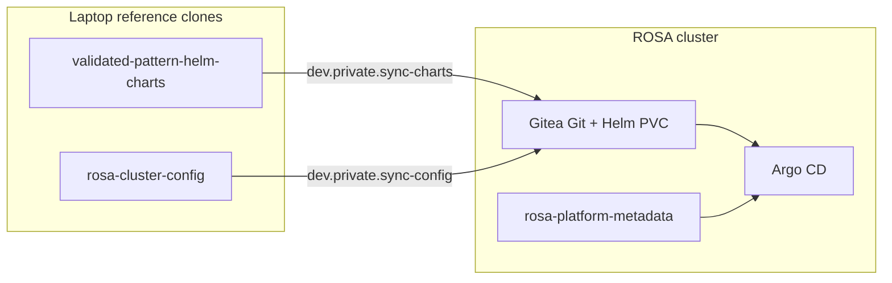

# Local Multi-Repo Development

Develop across the three-repository ROSA HCP pattern using local `reference/` clones of **cluster-config** and **helm-charts**, with **in-cluster Gitea** as the Git + Helm plane and **Argo CD** as the reconciler.

**Production / merge validation (unchanged):** Terraform apply → bootstrap → Argo sync from your published Helm repo + remote cluster-config Git (GitHub, CodeCommit, etc.).

See also: [Enablement Guide](../deployment/enablement.md) (org adoption), [Platform metadata / IRSA](../architecture/platform-metadata-irsa.md), [Bootstrap GitOps](../operations/bootstrap-gitops.md).

---

## When to use which workflow

| Goal | Workflow |
|------|----------|
| Local dev with Argo + in-cluster Gitea (recommended) | **`bootstrap-gitea`** + `dev.private.sync` (this guide) |
| Merge-ready PR / production adoption | Push branches in each repo → canonical Argo sync |
| Public GitHub dev (no Gitea) | Normal `bootstrap` → push to GitHub → Argo |
| Optional: fastest single-chart hack (no Gitea/Argo) | [Optional escape hatch](#optional-fastest-iteration-without-gitea) |

---

## Workspace layout

Clone sibling repos under `./reference/` (gitignored — local only):

```bash
mkdir -p reference && cd reference

git clone https://github.com/rh-mobb/rosa-cluster-config.git rosa-cluster-config
git clone https://github.com/rh-mobb/validated-pattern-helm-charts.git validated-pattern-helm-charts

cd ..
```

Optional (Terraform/provider patterns — [README.md](../../README.md#development-setup)):

- `reference/terraform-rosa`
- `reference/terraform-provider-rhcs`
- `reference/rosa-hcp-dedicated-vpc`

| Term | Meaning |
|------|---------|
| `clusters/*/terraform.tfvars` | Example **recipes** in this repo |
| `./reference/*` | Local **git clones** for dev and Cursor context |

---

## Prerequisites

1. **Cluster exists** — `make cluster.<profile>.apply`
2. **`enable_gitops_bootstrap = true`** in tfvars
3. **Reference clones** — see [Workspace layout](#workspace-layout)
4. **`gitops_git_path`** in tfvars matches a path under `reference/rosa-cluster-config/` (e.g. `dev/bgp`)
5. **Logged in** — `make cluster.<profile>.login`

---

## Architecture



| Enterprise pattern | This demo |
|--------------------|-----------|
| GitHub Enterprise / GitLab | Gitea Git (`rosa-cluster-config`) |
| Artifactory / Nexus Helm repo | Gitea Helm package registry |
| Argo CD | Unchanged |

**No S3** — Gitea persists to a cluster PVC (EBS on ROSA).

---

## One-time bootstrap

```bash
make cluster.<profile>.bootstrap-gitea
```

`bootstrap-private` is a deprecated alias. This target is the in-cluster Gitea local-dev loop — it is independent of a private ROSA cluster (`network_type` / `private = true`).

Runs `bootstrap-gitops.sh --gitea`, which:

1. Installs **Gitea** (namespace `gitea`, 10Gi PVC)
2. Creates org **`gitops`**, repo **`rosa-cluster-config`**
3. Seeds Git + Helm packages from `reference/` (when clones exist)
4. Patches bootstrap values to in-cluster Gitea URLs and aligns `targetRevision` pins from reference `Chart.yaml` when ahead of Terraform defaults (`private_gitops_patch_bootstrap_values`)
5. Installs **cluster-bootstrap** from local chart path (laptop cannot use Gitea index `cluster.local` URLs) + publishes **`rosa-platform-metadata`**
6. Writes **`clusters/<profile>/private-gitops.env`** (gitignored credentials)

---

## Inner loop (primary)

```bash
# Edit local clones
vim reference/validated-pattern-helm-charts/charts/external-secrets-operator/...
vim reference/rosa-cluster-config/dev/<cluster>/infrastructure.yaml

# Push to Gitea (port-forward to gitea-http is automatic)
make dev.private.sync DEV_CLUSTER_NAME=<profile>

# Optional: hard Argo refresh
oc patch application cluster-config -n openshift-gitops --type merge \
  -p '{"metadata":{"annotations":{"argocd.argoproj.io/refresh":"hard"}}}' 2>/dev/null || true
```

| Make target | Action |
|-------------|--------|
| `dev.private.preflight` | Gitea reachable, clones present |
| `dev.private.sync-config` | `git push` cluster-config only |
| `dev.private.sync-charts` | Package and upload all `charts/*` (version from each `Chart.yaml`; re-upload replaces same version) |
| `dev.private.sync` | Both |

### Credentials and URLs

After bootstrap, see `clusters/<profile>/private-gitops.env`:

| Variable | Purpose |
|----------|---------|
| `GITEA_INTERNAL_URL` | In-cluster base URL (Argo uses this) |
| `GITEA_GIT_REPO_URL` | cluster-config Git remote |
| `GITEA_HELM_REPO_URL` | Helm package registry |
| `GITEA_ADMIN_USER` / `GITEA_ADMIN_PASSWORD` | Push + Argo repo secrets |

Laptop sync uses **port-forward** to `gitea-http` (default local port `13000`).

---

## What this loop validates

- Argo CD Application wiring from in-cluster Git + Helm URLs
- Chart versions and `infrastructure.yaml` values as Argo sees them
- Private-customer analogue (GitLab + Artifactory) without GitHub Pages or S3

Always run **canonical** validation (push PRs → published Helm repo + remote Git → Argo) before merging.

---

## Editing workflow by repository

| Change type | Edit in | Local test | Canonical validation |
|-------------|---------|------------|----------------------|
| Terraform IAM, metadata outputs | This repo | `make cluster.<name>.plan/apply` | PR here |
| Helm chart templates/values | `reference/validated-pattern-helm-charts` | `dev.private.sync` → Argo sync | Publish chart repo + PR |
| Infrastructure app list / values | `reference/rosa-cluster-config/dev/<cluster>/infrastructure.yaml` | `dev.private.sync` → Argo sync | Push branch; Argo sync |
| Application namespaces | `applications-ns.yaml` | Argo (after sync-config) | Argo `app-of-apps-application` |

### Recommended PR land order (cross-cutting changes)

1. **Terraform** — IAM, Secrets Manager, bootstrap metadata outputs
2. **Helm charts** — chart API, platform-metadata hooks
3. **cluster-config** — `infrastructure.yaml` entries referencing new chart versions

Each repo is a **separate git remote** under `reference/` — commit and push in each; do not commit sibling repos into this infrastructure repo.

---

## Commit and PR choreography

### Helm charts repo

```bash
cd reference/validated-pattern-helm-charts
git checkout -b feat/my-chart-change
helm lint charts/<name>
git commit -am "feat(<chart>): describe change"
git push -u origin feat/my-chart-change
gh pr create ...
```

### cluster-config repo

```bash
cd reference/rosa-cluster-config
git checkout -b dev/<cluster>-my-feature
git commit -am "feat(<cluster>): adjust infrastructure"
git push -u origin dev/<cluster>-my-feature
gh pr create ...
```

Point Terraform at your branch for canonical validation:

```hcl
gitops_git_target_revision = "dev/<cluster>-my-feature"
```

### This repo (Terraform)

Only when infra/module/tfvars change. Update **this repo's** `CHANGELOG.md` only; chart and cluster-config repos maintain their own changelogs.

---

## Optional: fastest iteration without Gitea

Use only when you need **seconds-per-chart** feedback without Gitea push or Argo reconciliation — for example a single chart template change or debugging Helm values.

```bash
make cluster.<profile>.bootstrap-skip-gitops   # platform metadata only; no Argo
make dev.public.preflight
make dev.public.apply-local                      # helm from local chart dirs
# Single chart:
DEV_CHART_FILTER=external-secrets-operator make dev.public.apply-local
make dev.public.verify
```

`scripts/dev/public-local-loop.sh` also supports `render` (helm template) and `DEV_DRY_RUN=true`.

**Limitations:** No Argo sync waves, health gates, prune/self-heal, or ApplicationSet behavior. Does not test the Gitea/Argo private plane. Prefer `dev.private.sync` for merge-ready validation.

**ESO / platform metadata:** Charts with `platformMetadata.enabled: true` need `rosa-platform-metadata` from bootstrap (including `bootstrap-skip-gitops`). See [platform-metadata-irsa.md](../architecture/platform-metadata-irsa.md).

---

## Customer mapping (enablement talking points)

- **Gitea** → GitLab / GHE / Bitbucket Data Center
- **Gitea Helm packages** → Artifactory / Nexus / Harbor HTTP repo
- Keep **Argo CD** + **platform metadata** from Terraform bootstrap
- Same **`infrastructure.yaml`** contract as public GitOps

---

## Troubleshooting

| Symptom | Likely cause | Fix |
|---------|--------------|-----|
| `Private GitOps env not found` | `bootstrap-gitea` not run | `make cluster.<profile>.bootstrap-gitea` |
| Gitea curl fails | Pod not ready / no port-forward | `oc get pods -n gitea`; `oc port-forward svc/gitea-http -n gitea 13000:3000` |
| Argo cannot pull charts | Missing repo secret | `oc get secret -n openshift-gitops -l argocd.argoproj.io/secret-type=repository` |
| Chart upload fails | Missing chart dir or helm package error | Check sync warnings; some charts need remote subchart deps |
| `infrastructure.yaml not found` | `gitops_git_path` mismatch | Align tfvars with `reference/rosa-cluster-config/<path>/` |
| ESO IRSA empty | Metadata missing | `oc get cm rosa-platform-metadata -n openshift-gitops` |
| Version pin drift | Terraform defaults behind reference clone or Gitea upload | Bump cluster-module variables per [AGENTS.md](../../AGENTS.md); `bootstrap-gitea` patches `targetRevision` from reference `Chart.yaml` during dev |

---

## Scripts

| Script | Role |
|--------|------|
| `scripts/cluster/private-gitea.sh` | Install Gitea, write `private-gitops.env` |
| `scripts/dev/private-sync.sh` | Push config/charts to Gitea |
| `scripts/dev/private-gitops-lib.sh` | Shared helpers |
| `scripts/dev/public-local-loop.sh` | Optional escape hatch (`apply-local`, `render`) |
| `scripts/cluster/bootstrap-gitops.sh` | `--gitea`, `--skip-gitops` |
| `scripts/cluster/e2e-private-gitops.sh` | End-to-end regression: apply → `bootstrap-gitea` → sync → Argo verify |

---

## E2E regression test

Greenfield validation of the private GitOps loop (used after bootstrap or chart-pin changes):

```bash
# Optional: fresh cluster name to avoid IAM/VPC leftovers from prior destroys
E2E_CLUSTER_NAME=cz-gitops-e2e E2E_CLUSTER_PROFILE=public scripts/cluster/e2e-private-gitops.sh
```

Or `make cluster.<profile>.destroy_force` first, then run the script. Expect all Argo Applications (`cluster-config`, `application-ns`, and child infra apps) **Synced** / **Healthy**. Logs: `clusters/<profile>/logs/*-e2e-private-gitops.log` (gitignored).

---

## AI agent notes

- Use **tmux** for long `apply`/`bootstrap` operations — see [AGENTS.md](../../AGENTS.md).
- Do **not** hardcode `arn:aws:iam::ACCOUNT:role/...` in portable cluster-config — use `platformMetadata.enabled: true`.
- Track follow-ups in **GitHub Issues** (not scratch files).
- Zero-egress ECR pull-through mirrors: [#56](https://github.com/rh-mobb/validated-pattern-terraform-rosa/issues/56) (deferred).
