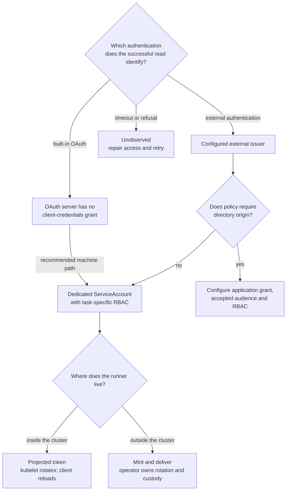

<!--
Purpose: Choose a CI pipeline identity for a ROSA HCP cluster and know why.
What this is not: Authentication choice does not grant install RBAC or close disconnected image supply.
Prerequisites: Know which authentication your cluster uses; a rotation policy; a target namespace.
Authoritative references:
- https://docs.redhat.com/en/documentation/openshift_container_platform/4.20/html/authentication_and_authorization/understanding-authentication
- https://kubernetes.io/docs/reference/access-authn-authz/service-accounts-admin/
- https://kubernetes.io/docs/reference/access-authn-authz/rbac/
-->

# Pipeline identities

An external CI worker needs three things: an identity, a way to authenticate as
it, and an RBAC binding. Those choices do not change the images or Kubernetes
objects the pipeline installs.

This page chooses between the options. The detail lives in three companion
pages, and **most readers need only the first**:

| Page | Read it when |
|---|---|
| [ServiceAccount identity](service-account-identity.md) | Almost always. It works on every ROSA HCP cluster and it is the recommendation below. Includes runnable Jenkins and GitLab pipelines. |
| [Built-in OAuth clusters](built-in-oauth-clusters.md) | Your cluster uses the built-in OpenShift OAuth server, and you want to know what else exists there — and what does not. |
| [External-auth clusters](external-auth-clusters.md) | Your cluster was created with `external_auth_providers_enabled = true` and you want a machine identity that comes from your directory. |

Throughout, **ServiceAccount** means a Kubernetes ServiceAccount. It is not an
RHCS service account or offline token — those authenticate Terraform to the ROSA
*management* API and cannot be presented to the Kubernetes API server as a
pipeline identity.

## The recommendation, first

**Use a dedicated Kubernetes ServiceAccount unless you have a specific reason
not to.** It works identically on both cluster authentication architectures, it
needs no directory involvement, and it is the demonstrated and recommended
machine path on the default ROSA HCP cluster.

The specific reason not to is almost always the same one: **an audit or security
policy that requires every identity to originate in the central directory.** If
that applies to you, and your cluster uses external authentication, read
[External-auth clusters](external-auth-clusters.md). If that applies and your
cluster uses built-in OAuth, its OAuth server has no client-credentials grant — see
[Built-in OAuth clusters](built-in-oauth-clusters.md) for what to do instead.

## Which cluster do you have?

This decides what is available at all, and it is a property of the cluster fixed
at creation, not a runtime setting.

| | Built-in OpenShift OAuth | External authentication |
|---|---|---|
| Created by | the default; optionally with human-login identity providers configured through [`oidc_identity_providers`](../built-in-oauth-oidc.md) | `external_auth_providers_enabled = true` |
| Who validates an API request | the cluster's own OAuth server, which issues its own access tokens | your identity provider's OIDC tokens, validated directly by the API server |
| Client-credentials grant | **not supported by the OpenShift OAuth server** (documented) | provider-issued token from a configured confidential application |
| Kubernetes ServiceAccount | available | available |
| Human login | through the OAuth server | directly against the provider |

Read the answer off the cluster rather than off a runbook:

```bash
# Covers: --cluster, -o, --request-timeout, jq -e, jq -r
# Does: Reads whether the cluster was created with external authentication.
# Why: The available pipeline identities differ by architecture, and the setting is fixed at creation.
# Change: Reading a different cluster returns that cluster's architecture, not this one's.
# Trap: A cluster with OIDC identity providers configured is still a built-in-OAuth cluster; the two are not the same thing.
# Evidence: https://docs.redhat.com/en/documentation/red_hat_openshift_service_on_aws/4/html/cli_tools/rosa-cli
# Management-plane read. "true" means external authentication; "false" means built-in OAuth.
#
# Keep a failed command distinct from an absent field. If `rosa` cannot read the
# cluster, that is not evidence of anything about its architecture, so the value
# is only interpreted when the read succeeded. `tostring` keeps `jq -e` from
# treating a legitimate `false` as an empty result.
if cluster_json=$(rosa describe cluster --cluster <cluster-id> -o json); then
  printf '%s\n' "$cluster_json" |
    jq -er '(.external_auth_config.enabled // false) | tostring'
else
  echo 'unobserved: management-plane read failed; do not infer an architecture' >&2
fi

# Guest-side confirmation, for when you have a kubeconfig but not the cluster id.
# An external-auth cluster has no OAuth server, so this resource is absent there.
# Read the outcome rather than the exit status: see the three cases below.
# Ref: https://github.com/openshift/openshift-docs/blob/3fc89d132cac41b69f79d37fd8ee3f99d134700d/authentication/external-auth.adoc
oc get oauth cluster --request-timeout=30s -o name
```

**The guest read has three outcomes, not two**, and collapsing them is the
mistake worth avoiding:

| Result | Means |
|---|---|
| an object name | **built-in OAuth** — the OAuth server exists |
| explicit `NotFound`, or the `oauth.config.openshift.io` API absent | **external authentication** |
| timeout, `Forbidden`, `Unauthorized`, anything else | **unobserved** |

A timeout or an authorization error is never evidence that OAuth is absent. Fix
the credential or the connection and retry; do not let a failed read choose an
architecture for you, because every later decision follows from that answer.

The decision below uses the documented OAuth grant boundary and the
ServiceAccount deployment observation described below. Directory origin is a
policy choice; application access also requires the configured issuer, audience
and RBAC. For an in-cluster runner, [the kubelet rotates the projected token and
the client must reload it](https://kubernetes.io/docs/tasks/configure-pod-container/configure-service-account/#serviceaccount-token-volume-projection).



## The options, with their trade-offs

| Option | Available on | Recommended when | Cost you accept |
|---|---|---|---|
| **[ServiceAccount](service-account-identity.md)** — a Kubernetes identity you mint tokens for | both architectures | the default choice for CI | A local cluster account: outside directory joiner/leaver processes, and not disabled when a person leaves. You own rotation and custody of the exported token. |
| **[Directory machine identity](external-auth-clusters.md)** — a confidential application authenticating with client credentials | external auth only | policy requires a directory-owned identity, and you accept a client secret in CI | A secret or certificate to rotate, a provider dependency at deploy time, and a username-claim decision that also changes how humans appear to RBAC. |
| **[Projected token](service-account-identity.md#where-the-runner-lives-decides-the-delivery-mechanism)** — Kubernetes mounts and rotates the token | both, in-cluster runners only | the pipeline runs as a Pod on the target cluster | Only available inside the cluster. Not an option for an external CI server. |
| **Directory user session** (device code) | both, but see the note | a human can seed a session and audit requires a person's name | Not unattended: a human logs in again when the session ends. The audit trail attributes automation to a person. Covered by the pattern's [external authentication guide](../external-auth-entra-id.md#cicd-pipeline-access). |
| **Cluster administrator credential** | — | **never** | Shared, `cluster-admin`, and it collapses the audit trail. It is a break-glass credential, not a pipeline identity. |

### Why the ServiceAccount is the default

- **It is architecture-independent.** The documented
  [TokenRequest API](https://kubernetes.io/docs/reference/access-authn-authz/service-accounts-admin/#tokenrequest-api)
  is a Kubernetes ServiceAccount mechanism, separate from directory login.
  Minting, audience and lifetime results below were observed on ROSA HCP
  4.20.33 on 2026-09-04. Earlier external-auth comparisons lack original
  captures available to this review and are not verified here.
- **It is the demonstrated and recommended machine path on built-in OAuth.**
  The [OpenShift OAuth server](https://docs.redhat.com/en/documentation/openshift_container_platform/4.20/html/authentication_and_authorization/configuring-internal-oauth)
  supports authorization-code and implicit flows, with no client-credentials
  grant. On ROSA HCP 4.20.33 on 2026-09-04, a provider-issued
  token for a real directory user was
  refused HTTP 401 by the API server. That user-token result does not establish
  a universal machine-token refusal; the recommendation stands on the supported
  OAuth flows and the demonstrated ServiceAccount path.
- **RBAC determines capability.** The [RBAC authorization model](https://kubernetes.io/docs/reference/access-authn-authz/rbac/)
  grants permissions to authenticated subjects. A projected ServiceAccount
  token applied and rolled out a Deployment under the example Role on ROSA HCP
  4.20.33 on 2026-09-05, with delete and Secret list refused. The older
  same-work comparison with a directory machine identity is not verified here: its
  original capture was not located.
- **Revocation is one object.** On ROSA HCP 4.20.33 on 2026-09-04,
  deleting the ServiceAccount stopped
  its issued token: a request that had returned HTTP 200 returned HTTP 401
  within 0.4 s.

  A focused repeat on that system and date exposed a verification caveat.
  Recreating a ServiceAccount with the **same name** in the same namespace made
  the old token briefly acceptable again; it returned to HTTP 401 within `(0.622 s, 1.201 s]`. The old
  bearer was byte-identical by SHA-256, the new object carried a different UID,
  and a control token from the new account worked. The authentication-cache
  cause remains unproven; these are bounded request observations. **The practical consequence is for
  how you verify:** a script that deletes, recreates and *then* checks can
  observe HTTP 200 and conclude revocation failed. Verify against the deleted
  account, before anything reclaims the name.

  Removing an OAuth identity provider is a different operation. The pattern's
  [OpenID Connect guide](../built-in-oauth-oidc.md#change-or-remove-a-provider)
  reports a lower bound on survival of an already-issued OAuth session after
  provider deletion; that upstream reading does not measure ServiceAccount
  revocation.

### Why you might still not use it

A ServiceAccount is a **local account on the cluster**. It does not exist in the
directory, it is not covered by directory joiner and leaver processes, and it is
not disabled when a person leaves. An organisation that requires central
identity for everything will treat it as an exception.

Whether that exception is temporary or permanent depends on which architecture
the cluster uses — which is why this page asks that question first.

## What every option shares

Three things do not change with the choice, and are documented once on the
[ServiceAccount identity](service-account-identity.md) page because that is where
most readers meet them:

- **Authorization.** RBAC compares strings from the authenticated request and
  never looks up a `User`, `Identity` or `Group` object. See
  [the rule](service-account-identity.md#how-rbac-actually-decides).
- **Custody.** A bearer token is a credential in every option: keep it out of
  argv, out of environment dumps, out of CI artifacts, and verify job-local cleanup, with ephemeral-runner disposal for failures
  that prevent cleanup handlers from running.
- **Authentication does not grant authorization or close image supply.** A
  pipeline can authenticate perfectly and still fail because it lacks a verb, or
  because a worker cannot pull one digest. On a disconnected cluster, see the
  disconnected Operator installation guide for the supply half.
