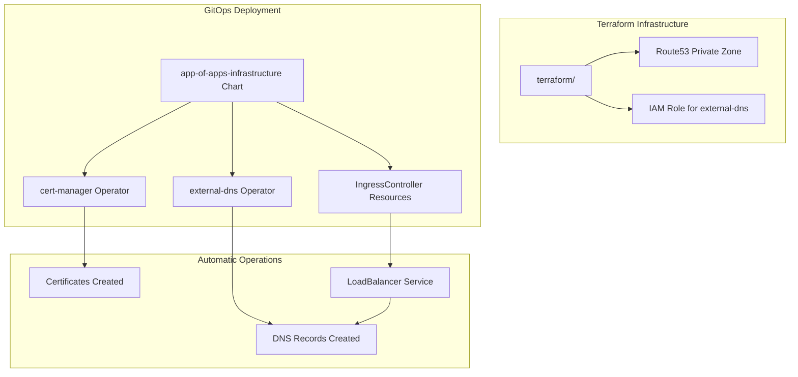

# Ingress Controller Implementation with cert-manager and external-dns

## Overview

This document describes the implementation plan for additional ingress controllers using cert-manager and external-dns operators. This approach eliminates the need for shell scripts and Helm CLI calls from Terraform, instead relying on Kubernetes operators to automatically manage certificates and DNS records.

## Architecture

### Design Philosophy

- **Terraform**: Creates only AWS infrastructure prerequisites (Route53 zone, IAM roles)
- **GitOps/Helm**: Deploys cert-manager, external-dns, and ingress controllers via `app-of-apps-infrastructure` chart
- **Operators**: cert-manager and external-dns automatically handle certificates and DNS records

### Workflow



## Implementation Steps

### Phase 1: Terraform Infrastructure

#### 1.1 Route53 Private Hosted Zone

**File**: `modules/infrastructure/cluster/60-route53.tf` (new)

Create a Route53 private hosted zone for the cluster's base domain. This zone will be used by external-dns to automatically create DNS records.

```hcl
# Route53 Private Hosted Zone for Ingress Controllers
# Reference: ./reference/pfoster/rosa-hcp-dedicated-vpc/terraform/11.ingress.tf
# This creates a private Route53 hosted zone for the cluster's base domain.
# external-dns operator will automatically create DNS records in this zone for ingress controllers.
#
# The zone persists through sleep operations to maintain DNS consistency.

resource "aws_route53_zone" "cluster" {
  count = local.persists_through_sleep && var.enable_route53_zone ? 1 : 0

  name = var.route53_zone_name != null ? var.route53_zone_name : (
    # Default to cluster base domain if available, otherwise use cluster name
    try(rhcs_cluster_rosa_hcp.main.domain, "${var.cluster_name}.local")
  )

  vpc {
    vpc_id = var.vpc_id
  }

  tags = merge(local.common_tags, {
    Name      = "${var.cluster_name}-route53-zone"
    Purpose   = "IngressDNS"
    ManagedBy = "Terraform"
    persists_through_sleep = "true"
  })

  depends_on = [
    rhcs_cluster_rosa_hcp.main
  ]
}
```

**Key Points**:
- Zone name defaults to cluster base domain if available
- Private zone associated with VPC for internal DNS resolution
- Persists through sleep operations
- Created only when `enable_route53_zone = true`

#### 1.2 IAM Role for external-dns

**File**: `modules/infrastructure/cluster/61-external-dns-iam.tf` (new)

Create an IAM role and policy for external-dns to manage Route53 records. The role uses OIDC federation to allow the external-dns service account to assume the role.

```hcl
# External-DNS IAM Configuration
# Reference: AWS external-dns documentation
# This configuration creates an IAM role and policy for external-dns to manage Route53 records.
# The role uses OIDC federation to allow the external-dns service account to assume the role.
#
# IMPORTANT: The OIDC endpoint URL must NOT include the "https://" prefix when used in IAM trust policies.
# Reference: Red Hat documentation shows stripping https:// from the OIDC endpoint URL
# The oidc_endpoint_url_normalized local is defined in 10-main.tf

# IAM Policy for External-DNS
# Grants permissions to manage Route53 records in the cluster's hosted zone
resource "aws_iam_policy" "external_dns" {
  count = local.persists_through_sleep && var.enable_external_dns_iam ? 1 : 0

  name        = "${var.cluster_name}-rosa-external-dns"
  path        = "/"
  description = "IAM policy for external-dns to manage Route53 records"

  policy = jsonencode({
    Version = "2012-10-17"
    Statement = [
      {
        Effect = "Allow"
        Action = [
          "route53:ChangeResourceRecordSets"
        ]
        # Restrict to specific hosted zone for security
        Resource = length(aws_route53_zone.cluster) > 0 ? [
          "arn:aws:route53:::hostedzone/${aws_route53_zone.cluster[0].zone_id}"
        ] : ["*"]
      },
      {
        Effect = "Allow"
        Action = [
          "route53:ListResourceRecordSets",
          "route53:ListHostedZones"
        ]
        # List operations require "*" but actual changes are restricted above
        Resource = "*"
      }
    ]
  })

  tags = merge(local.common_tags, {
    Name      = "${var.cluster_name}-rosa-external-dns-policy"
    Purpose   = "ExternalDNS"
    ManagedBy = "Terraform"
  })
}

# IAM Role for External-DNS
# Uses OIDC federation to allow the external-dns service account to assume this role
# Service account: system:serviceaccount:{namespace}:{service_account}
resource "aws_iam_role" "external_dns" {
  count = local.persists_through_sleep && var.enable_external_dns_iam ? 1 : 0

  name = "${var.cluster_name}-rosa-external-dns-role-iam"

  assume_role_policy = jsonencode({
    Version = "2012-10-17"
    Statement = [
      {
        Effect = "Allow"
        Principal = {
          Federated = "arn:aws:iam::${data.aws_caller_identity.current.account_id}:oidc-provider/${local.oidc_endpoint_url_normalized}"
        }
        Action = "sts:AssumeRoleWithWebIdentity"
        Condition = {
          StringEquals = {
            "${local.oidc_endpoint_url_normalized}:sub" = "system:serviceaccount:${var.external_dns_namespace}:${var.external_dns_service_account}"
          }
        }
      }
    ]
  })

  tags = merge(local.common_tags, {
    Name      = "${var.cluster_name}-rosa-external-dns-role-iam"
    Purpose   = "ExternalDNS"
    ManagedBy = "Terraform"
  })
}

# Attach the External-DNS policy to the role
resource "aws_iam_role_policy_attachment" "external_dns" {
  count = local.persists_through_sleep && var.enable_external_dns_iam ? 1 : 0

  role       = aws_iam_role.external_dns[0].name
  policy_arn = aws_iam_policy.external_dns[0].arn

  depends_on = [
    aws_iam_policy.external_dns,
    aws_iam_role.external_dns
  ]
}
```

**Key Points**:
- Policy restricts Route53 changes to the specific hosted zone
- List operations use `*` (required by external-dns)
- OIDC trust policy for external-dns service account
- Configurable namespace and service account names

#### 1.3 Variables

**File**: `modules/infrastructure/cluster/01-variables.tf`

Add the following variables:

```hcl
variable "enable_route53_zone" {
  description = "Enable Route53 private hosted zone creation for ingress controllers. When enabled, creates a private Route53 zone for the cluster's base domain. external-dns will use this zone to automatically create DNS records."
  type        = bool
  nullable    = false
  default     = false
}

variable "route53_zone_name" {
  description = "Name of the Route53 hosted zone. If null, defaults to cluster base domain. Example: 'apps.cluster.example.com'"
  type        = string
  default     = null
  nullable    = true
}

variable "enable_external_dns_iam" {
  description = "Enable IAM role and policy for external-dns to manage Route53 records. When enabled, creates IAM role for external-dns service account to assume via OIDC."
  type        = bool
  nullable    = false
  default     = false
}

variable "external_dns_service_account" {
  description = "Name of the external-dns service account (default: 'external-dns')"
  type        = string
  nullable    = false
  default     = "external-dns"
}

variable "external_dns_namespace" {
  description = "Namespace where external-dns is deployed (default: 'external-dns')"
  type        = string
  nullable    = false
  default     = "external-dns"
}
```

#### 1.4 Outputs

**File**: `modules/infrastructure/cluster/90-outputs.tf`

Add the following outputs:

```hcl
output "route53_zone_id" {
  description = "ID of the Route53 private hosted zone (null if enable_route53_zone is false)"
  value       = local.persists_through_sleep && var.enable_route53_zone && length(aws_route53_zone.cluster) > 0 ? aws_route53_zone.cluster[0].zone_id : null
  sensitive   = false
}

output "route53_zone_name" {
  description = "Name of the Route53 private hosted zone (null if enable_route53_zone is false)"
  value       = local.persists_through_sleep && var.enable_route53_zone && length(aws_route53_zone.cluster) > 0 ? aws_route53_zone.cluster[0].name : null
  sensitive   = false
}

output "external_dns_role_arn" {
  description = "ARN of the IAM role for external-dns to manage Route53 records (null if enable_external_dns_iam is false)"
  value       = local.persists_through_sleep && var.enable_external_dns_iam && length(aws_iam_role.external_dns) > 0 ? aws_iam_role.external_dns[0].arn : null
  sensitive   = false
}
```

#### 1.5 Root Module Updates

**File**: `terraform/01-variables.tf`

Add root-level variables:

```hcl
variable "enable_route53_zone" {
  description = "Enable Route53 private hosted zone creation for ingress controllers"
  type        = bool
  default     = false
  nullable    = false
}

variable "route53_zone_name" {
  description = "Name of the Route53 hosted zone (optional, defaults to cluster base domain)"
  type        = string
  default     = null
  nullable    = true
}

variable "enable_external_dns_iam" {
  description = "Enable IAM role and policy for external-dns to manage Route53 records"
  type        = bool
  default     = false
  nullable    = false
}

variable "external_dns_service_account" {
  description = "Name of the external-dns service account"
  type        = string
  default     = "external-dns"
  nullable    = false
}

variable "external_dns_namespace" {
  description = "Namespace where external-dns is deployed"
  type        = string
  default     = "external-dns"
  nullable    = false
}
```

**File**: `terraform/10-main.tf`

Pass variables to cluster module:

```hcl
module "cluster" {
  # ... existing configuration ...

  # Route53 and External-DNS configuration
  enable_route53_zone          = var.enable_route53_zone
  route53_zone_name            = var.route53_zone_name
  enable_external_dns_iam      = var.enable_external_dns_iam
  external_dns_service_account = var.external_dns_service_account
  external_dns_namespace        = var.external_dns_namespace
}
```

**File**: `terraform/90-outputs.tf`

Expose outputs:

```hcl
output "route53_zone_id" {
  description = "ID of the Route53 private hosted zone"
  value       = module.cluster.route53_zone_id
  sensitive   = false
}

output "route53_zone_name" {
  description = "Name of the Route53 private hosted zone"
  value       = module.cluster.route53_zone_name
  sensitive   = false
}

output "external_dns_role_arn" {
  description = "ARN of the IAM role for external-dns to manage Route53 records"
  value       = module.cluster.external_dns_role_arn
  sensitive   = false
}
```

### Phase 2: Helm Chart Configuration (GitOps)

**Note**: These steps are done in the cluster-config Git repository, not in Terraform.

#### 2.1 Update app-of-apps-infrastructure Chart

Add cert-manager, external-dns, and ingress controller deployments to the `app-of-apps-infrastructure` chart configuration.

**Example**: `cluster-config/dev/{cluster-name}/infrastructure.yaml`

```yaml
infrastructure:
  # Cert-Manager (if not already deployed)
  - chart: cert-manager
    targetRevision: v1.13.0
    namespace: cert-manager
    values:
      installCRDs: true
      # ... cert-manager configuration ...

  # External-DNS
  - chart: external-dns
    targetRevision: 6.5.0
    namespace: external-dns
    values:
      provider: aws
      aws:
        region: us-east-2
      zoneType: private
      domainFilters:
        - "apps.cluster.example.com"  # Use route53_zone_name from Terraform output
      txtOwnerId: "cluster-name"  # Unique identifier for this cluster
      policy: sync
      serviceAccount:
        annotations:
          eks.amazonaws.com/role-arn: "arn:aws:iam::ACCOUNT_ID:role/CLUSTER-NAME-rosa-external-dns-role-iam"  # Use external_dns_role_arn from Terraform output
      sources:
        - ingress
        - crd
        - service
      crd:
        create: true
      logFormat: json
      logLevel: info

  # Ingress Controller Chart
  - chart: cluster-ingress
    targetRevision: 0.0.9
    namespace: openshift-ingress-operator
    values:
      ingressControllers:
        - name: apps
          domain: "apps.cluster.example.com"
          replicas: 3
          endpointPublishingStrategy:
            type: LoadBalancerService
            loadBalancer:
              scope: Internal
              dnsManagementPolicy: Managed  # Let external-dns handle DNS
              providerParameters:
                type: AWS
                aws:
                  type: NLB
          namespaceSelector:
            matchLabels:
              ingress: apps
```

#### 2.2 Create/Update Ingress Controller Chart

The ingress controller chart should create `IngressController` resources with annotations for cert-manager and external-dns.

**Example**: `cluster-ingress/templates/ingresscontroller.yaml`

```yaml
apiVersion: operator.openshift.io/v1
kind: IngressController
metadata:
  name: {{ .Values.name }}
  namespace: openshift-ingress-operator
  annotations:
    # External-DNS annotations for automatic DNS record creation
    external-dns.alpha.kubernetes.io/hostname: "*.{{ .Values.domain }}"
    external-dns.alpha.kubernetes.io/ttl: "300"
spec:
  domain: {{ .Values.domain }}
  endpointPublishingStrategy:
    type: LoadBalancerService
    loadBalancer:
      scope: Internal
      dnsManagementPolicy: Managed  # Let external-dns handle DNS
      providerParameters:
        type: AWS
        aws:
          type: NLB
  replicas: {{ .Values.replicas }}
  namespaceSelector:
    matchLabels:
      ingress: {{ .Values.name }}
  defaultCertificate:
    # Cert-manager will create this certificate automatically
    name: "{{ .Values.name }}.{{ .Values.baseDomain }}"
```

**Example**: `cluster-ingress/templates/certificate.yaml`

```yaml
apiVersion: cert-manager.io/v1
kind: Certificate
metadata:
  name: {{ .Values.name }}.{{ .Values.baseDomain }}
  namespace: openshift-ingress
spec:
  dnsNames:
    - "*.{{ .Values.domain }}"
  issuerRef:
    group: awspca.cert-manager.io
    kind: AWSPCAClusterIssuer
    name: "aws-pca-cluster-issuer"  # Use existing cert-manager issuer
  secretName: {{ .Values.name }}.{{ .Values.baseDomain }}
```

## Configuration Examples

### Example 1: Enable Route53 Zone and External-DNS IAM

**File**: `clusters/public/terraform.tfvars`

```hcl
# Enable Route53 zone for ingress controllers
enable_route53_zone = true
# Zone name will default to cluster base domain

# Enable IAM role for external-dns
enable_external_dns_iam = true
# Service account defaults to "external-dns"
# Namespace defaults to "external-dns"
```

### Example 2: Custom Zone Name

```hcl
enable_route53_zone = true
route53_zone_name   = "apps.mycompany.com"
```

### Example 3: Custom External-DNS Configuration

```hcl
enable_external_dns_iam      = true
external_dns_service_account = "external-dns-controller"
external_dns_namespace       = "external-dns-system"
```

## Testing Procedures

### 1. Verify Route53 Zone Creation

```bash
# Get zone ID from Terraform output
terraform output route53_zone_id

# Verify zone exists
aws route53 get-hosted-zone --id $(terraform output -raw route53_zone_id)

# Verify zone is associated with VPC
aws route53 get-hosted-zone --id $(terraform output -raw route53_zone_id) --query 'VPCs'
```

### 2. Verify IAM Role

```bash
# Get role ARN from Terraform output
terraform output external_dns_role_arn

# Verify role exists
aws iam get-role --role-name $(terraform output -raw external_dns_role_arn | cut -d'/' -f2)

# Verify trust policy
aws iam get-role --role-name $(terraform output -raw external_dns_role_arn | cut -d'/' -f2) --query 'Role.AssumeRolePolicyDocument'
```

### 3. Verify External-DNS Deployment

```bash
# Check external-dns pods
oc get pods -n external-dns

# Check external-dns logs
oc logs -n external-dns deployment/external-dns

# Verify service account annotation
oc get sa external-dns -n external-dns -o jsonpath='{.metadata.annotations.eks\.amazonaws\.com/role-arn}'
```

### 4. Verify Ingress Controller

```bash
# Check IngressController resource
oc get ingresscontroller -n openshift-ingress-operator

# Check LoadBalancer service
oc get svc -n openshift-ingress | grep router-

# Verify DNS records created
aws route53 list-resource-record-sets --hosted-zone-id $(terraform output -raw route53_zone_id) --query 'ResourceRecordSets[?Type==`CNAME`]'
```

### 5. Verify Certificate Creation

```bash
# Check Certificate resource
oc get certificate -n openshift-ingress

# Check certificate status
oc describe certificate -n openshift-ingress

# Verify certificate secret
oc get secret -n openshift-ingress
```

## Troubleshooting

### External-DNS Not Creating DNS Records

1. **Check IAM Role**: Verify the service account has the correct annotation
   ```bash
   oc get sa external-dns -n external-dns -o yaml
   ```

2. **Check External-DNS Logs**: Look for permission errors
   ```bash
   oc logs -n external-dns deployment/external-dns
   ```

3. **Verify Zone ID**: Ensure external-dns is configured with the correct zone ID
   ```bash
   terraform output route53_zone_id
   ```

### Cert-Manager Not Creating Certificates

1. **Check Certificate Status**: Look for errors in certificate events
   ```bash
   oc describe certificate -n openshift-ingress
   ```

2. **Check Cert-Manager Logs**: Look for certificate request errors
   ```bash
   oc logs -n cert-manager deployment/cert-manager
   ```

3. **Verify Issuer**: Ensure the AWS PCA ClusterIssuer exists
   ```bash
   oc get awspcaclusterissuer
   ```

### Ingress Controller Not Getting LoadBalancer Address

1. **Check IngressController Status**: Look for errors
   ```bash
   oc describe ingresscontroller -n openshift-ingress-operator
   ```

2. **Check Service**: Verify LoadBalancer service exists
   ```bash
   oc get svc -n openshift-ingress
   ```

3. **Check AWS Load Balancer**: Verify NLB was created
   ```bash
   aws elbv2 describe-load-balancers --region us-east-2
   ```

## Dependencies

- Cluster must be deployed (for base domain and OIDC provider)
- OIDC provider must exist (for IAM role trust policy)
- GitOps must be bootstrapped (for Helm chart deployment)
- Cert-Manager IAM role must exist (if using AWS Private CA)
- VPC must exist (for Route53 zone association)

## Key Design Decisions

1. **Minimal Terraform**: Only AWS infrastructure (Route53 zone, IAM roles) in Terraform
2. **GitOps-First**: All Kubernetes resources deployed via Helm/GitOps
3. **Operator-Based**: cert-manager and external-dns handle automation
4. **No Scripts**: Eliminates need for shell scripts or Helm CLI calls from Terraform
5. **Persistent Resources**: Route53 zone persists through sleep operations
6. **Security**: IAM policy restricts Route53 changes to specific hosted zone

## Future Enhancements

- Multiple ingress controllers support (via Helm chart configuration)
- Custom domain support (via Route53 zone name variable)
- Integration with existing cert-manager IAM role (if already deployed)
- Support for public Route53 zones (currently private only)
- Support for multiple Route53 zones (for different domains)
- Integration with Route53 health checks for ingress controllers

## References

- [AWS External-DNS Documentation](https://github.com/kubernetes-sigs/external-dns)
- [Cert-Manager Documentation](https://cert-manager.io/docs/)
- [OpenShift Ingress Operator Documentation](https://docs.openshift.com/container-platform/latest/networking/ingress-operator.html)
- [Route53 Private Hosted Zones](https://docs.aws.amazon.com/Route53/latest/DeveloperGuide/hosted-zones-private.html)
- Reference Implementation: `./reference/pfoster/rosa-hcp-dedicated-vpc/terraform/11.ingress.tf`
