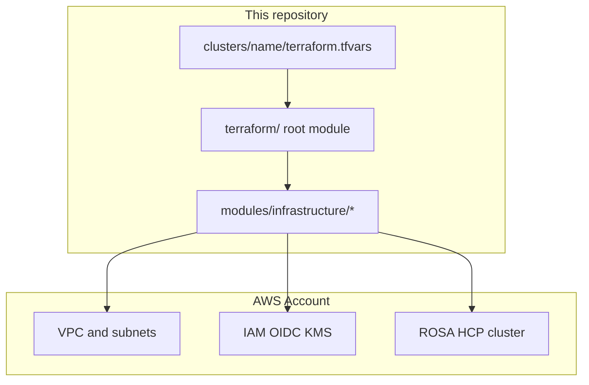

# ROSA HCP Terraform

Production-grade Terraform for deploying **Red Hat OpenShift Service on AWS (ROSA)** with **Hosted Control Planes (HCP)**.

This repository provides reusable Terraform modules and per-cluster configurations using a **directory-per-cluster** pattern for state isolation and lifecycle management.

## Documentation map

| I want to… | Start here |
|------------|------------|
| Deploy my first cluster quickly | [Quick Start](getting-started/quick-start.md) |
| Verify AWS account and ROSA prerequisites | [Account Prerequisites](prerequisites/account.md) |
| Choose full-stack vs bring-your-own (BYO) | [Prerequisites — Choose Your Path](prerequisites/index.md) |
| Follow the full enablement guide | [Enablement Guide](deployment/enablement.md) |
| Configure a specific cluster profile | [Cluster Configurations](deployment/cluster-configurations.md) |
| Deploy zero-egress with GitOps | [Egress-Zero GitOps](guides/egress-zero-gitops.md) |
| Look up module inputs/outputs | [Modules](modules/cluster.md) |

## Architecture at a glance



## Example cluster profiles

| Profile | Example directory | Typical use |
|---------|-------------------|-------------|
| Public (dev) | `clusters/public/` | Development, public API |
| Egress-zero (prod) | `clusters/egress-zero/` | Zero internet egress, private API |
| BYO VPC | `clusters/byo-vpc/` | Network team owns VPC |
| BYO VPC + zero egress | `clusters/byo-vpc-egress-zero/` | Pre-provisioned VPC, zero egress |

## Local preview

```bash
pip install -r requirements-docs.txt
make docs-preview
```

Open [http://127.0.0.1:8000](http://127.0.0.1:8000).

## Related repositories

This infrastructure repo is one part of the **three-repository pattern** for ROSA HCP + GitOps:

| # | Repository | Role | Upstream |
|---|------------|------|----------|
| 1 | **Infrastructure** | Terraform Day 0 — VPC, IAM, cluster, bootstrap orchestration | [rh-mobb/validated-pattern-terraform-rosa](https://github.com/rh-mobb/validated-pattern-terraform-rosa) (this repo) |
| 2 | **cluster-config** | GitOps configuration consumed by Argo CD after bootstrap | [rh-mobb/rosa-cluster-config](https://github.com/rh-mobb/rosa-cluster-config) |
| 3 | **Helm charts** | Bootstrap and app-of-apps charts (`cluster-bootstrap`, etc.) | [rh-mobb/validated-pattern-helm-charts](https://github.com/rh-mobb/validated-pattern-helm-charts) |

Published Helm repo (default in example tfvars): [https://rh-mobb.github.io/validated-pattern-helm-charts/](https://rh-mobb.github.io/validated-pattern-helm-charts/)

See the [Enablement Guide](deployment/enablement.md) for forking, publishing charts, and the full adoption path.
