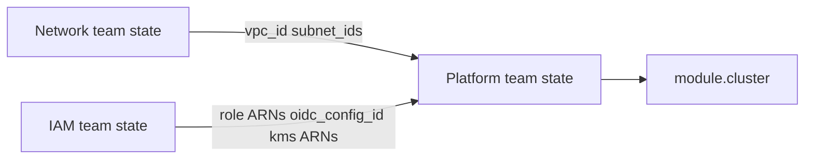

# BYO IAM and KMS Handoff

Layer **2b** — security/IAM team owns roles, OIDC, and KMS keys separately from the platform team.

## Current root module behavior

The unified root module ([`terraform/10-main.tf`](https://github.com/rh-mobb/validated-pattern-terraform-rosa/blob/main/terraform/10-main.tf)) **always** invokes `module "iam"`. There are no root-level variables to pass external installer role ARNs or pre-existing KMS keys today.

**BYO IAM/KMS requires module-level composition**, not `network_type = "existing"` alone.

## Multi-team pattern



### Network team outputs

```hcl
output "vpc_id"             { value = module.network.vpc_id }
output "private_subnet_ids" { value = module.network.private_subnet_ids }
output "vpc_cidr_block"     { value = module.network.vpc_cidr_block }
```

### IAM team outputs

```hcl
output "installer_role_arn" { value = module.iam.installer_role_arn }
output "support_role_arn"   { value = module.iam.support_role_arn }
output "worker_role_arn"    { value = module.iam.worker_role_arn }
output "oidc_config_id"     { value = module.iam.oidc_config_id }
output "ebs_kms_key_arn"    { value = module.iam.ebs_kms_key_arn }
output "etcd_kms_key_arn"   { value = module.iam.etcd_kms_key_arn }
```

### Platform team cluster module

```hcl
module "cluster" {
  source = "../modules/infrastructure/cluster"

  cluster_name       = var.cluster_name
  region             = var.region
  vpc_id             = var.vpc_id
  private_subnet_ids = var.private_subnet_ids
  installer_role_arn = var.installer_role_arn
  support_role_arn   = var.support_role_arn
  worker_role_arn    = var.worker_role_arn
  oidc_config_id     = var.oidc_config_id
  kms_key_arn        = var.ebs_kms_key_arn
  zero_egress        = var.zero_egress
  private            = var.private
  # ...
}
```

Coordinate via remote state, CI/CD pipeline variables, or shared tfvars files.

## KMS requirements (BYO keys)

Customer-managed KMS keys must:

- Reside in the **same AWS account** as the ROSA cluster
- Grant use to ROSA installer, worker, and support roles created by the IAM team
- Allow etcd encryption principal if `etcd_encryption = true`

If not providing external keys, the IAM module creates EBS, EFS, and etcd KMS keys automatically.

## Zero egress IAM note

When `zero_egress = true`, the IAM module attaches `AmazonEC2ContainerRegistryReadOnly` to the worker role. If IAM is BYO, the security team must attach this policy manually:

```bash
aws iam attach-role-policy \
  --role-name <prefix>-HCP-ROSA-Worker-Role \
  --policy-arn arn:aws:iam::aws:policy/AmazonEC2ContainerRegistryReadOnly
```

## When to use 2a vs 2b

| Scenario | Path |
|----------|------|
| Network team owns VPC only | **2a** — `network_type = "existing"`, root module runs IAM |
| Security team must own all IAM/KMS | **2b** — module composition |
| Single platform team | **Layer 1** — [Full-Stack](../full-stack.md) |

## Related

- [IAM module reference](../../modules/iam.md)
- [Handoff Checklist](handoff-checklist.md)
