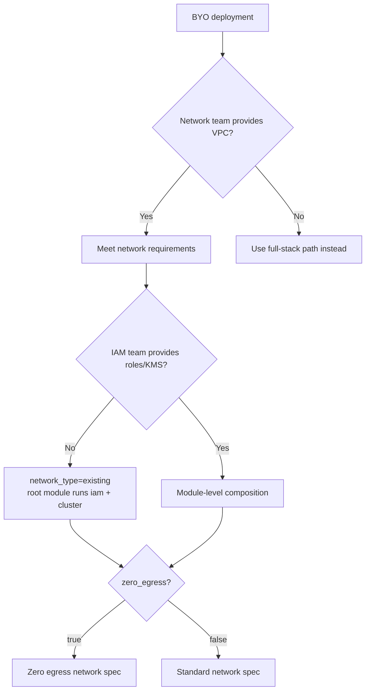

# Bring Your Own — Overview

Layer **2** — infrastructure is pre-provisioned by network and/or security teams; the platform team runs Terraform for the remaining layers.

## What this repo supports today

| Layer | BYO support | How |
|-------|-------------|-----|
| **Network (VPC, subnets, endpoints)** | Yes | `network_type = "existing"` + `existing_*` variables |
| **IAM / OIDC / KMS** | Module composition only | Root module always runs `module "iam"` — see [IAM and KMS Handoff](iam-kms.md) |
| **Cluster** | Yes | Always via `module "cluster"` |

## Path 2a — BYO network only (most common)

Network team provisions VPC, subnets, endpoints, and tags. Platform team sets:

```hcl
network_type = "existing"
existing_vpc_id             = "vpc-..."
existing_private_subnet_ids = ["subnet-...", "subnet-...", "subnet-..."]
existing_public_subnet_ids  = []  # empty for private API / zero egress
vpc_cidr                    = "10.0.0.0/16"  # must match actual VPC
```

Terraform still creates IAM, KMS, and the cluster.

**Examples:**

- `clusters/byo-vpc/` — standard BYO with public API
- `clusters/byo-vpc-egress-zero/` — BYO with zero egress

**Documentation:**

- [Network Requirements](network.md) — what the network team must build
- [Handoff Checklist](handoff-checklist.md) — values to pass to platform team

**Validation:**

```bash
make cluster.<name>.validate
# Or network only:
make cluster.<name>.validate-network --vpc-id vpc-xxx
```

## Path 2b — BYO network + BYO IAM/KMS

For enterprises with separate security/IAM teams owning roles and KMS keys:

- Compose `modules/infrastructure/{iam,cluster}` in separate Terraform states
- Pass network outputs and IAM outputs via remote state or `TF_VAR_*`
- **Not** supported as additional variables on the unified root module today

See [IAM and KMS Handoff](iam-kms.md).

## Decision tree



## Quick start (BYO network)

1. Network team completes [Network Requirements](network.md)
2. Platform team completes [Account Prerequisites](../account.md)
3. Copy example: `cp clusters/byo-vpc/terraform.tfvars clusters/my-byo/`
4. Set `existing_*` IDs in tfvars
5. Validate and deploy:

   ```bash
   make cluster.my-byo.validate
   make cluster.my-byo.init
   make cluster.my-byo.apply
   ```

## Alternative: `rosa create network`

ROSA CLI v1.2.48+ can create a compliant VPC via CloudFormation:

```bash
rosa create network \
  --param Region=<region> \
  --param Name=<stack-name> \
  --param AvailabilityZoneCount=3 \
  --param VpcCidr=10.0.0.0/16
```

For **zero egress**, remove NAT routes from private subnets and ensure only required endpoints exist — see [Network Requirements](network.md).

## Related

- [Customer Intake Form](../customer-intake.md)
- [Cluster Configurations](../../deployment/cluster-configurations.md)
