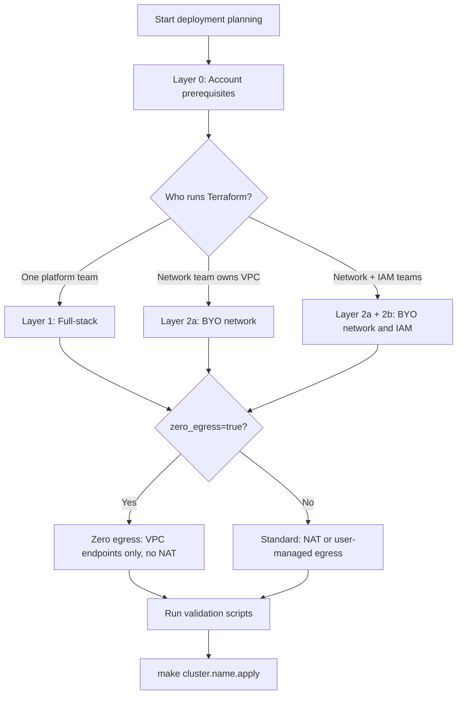

# Prerequisites — Choose Your Path

Before deploying a ROSA HCP cluster, determine **who owns each infrastructure layer** and **what egress/API posture** you need.

## Three questions

1. **Does one team run the full Terraform lifecycle from this repo?**  
   → [Full-Stack Deployment](full-stack.md)

2. **Does another team pre-provision the VPC (or other infrastructure)?**  
   → [Bring Your Own — Overview](byo/index.md)

3. **Is this a zero-egress cluster?**  
   → Apply the zero-egress overlay in [Network Requirements](byo/network.md) (works with full-stack or BYO)

## Decision tree

## Layers summary

| Layer | Scope | Document | Validation |
|-------|-------|----------|------------|
| **0 — Account** | AWS account, ROSA Marketplace, quotas, operator tools | [Account Prerequisites](account.md) | `make cluster.<name>.validate` |
| **1 — Full-stack** | Terraform creates VPC, IAM, cluster | [Full-Stack Deployment](full-stack.md) | Account validation before init |
| **2a — BYO network** | Pre-provisioned VPC, subnets, endpoints | [BYO Network](byo/network.md) | `make cluster.<name>.validate-network` |
| **2b — BYO IAM/KMS** | Separate security team owns roles/keys | [BYO IAM and KMS](byo/iam-kms.md) | Manual handoff checklist |

## Customer intake

For delivery teams collecting requirements from a customer, use the [Customer Intake Form](customer-intake.md).

## Related

- [Enablement Guide](../deployment/enablement.md) — full adoption path
- [Cluster Configurations](../deployment/cluster-configurations.md) — example tfvars
- [Validation Scripts](../operations/validation.md)
